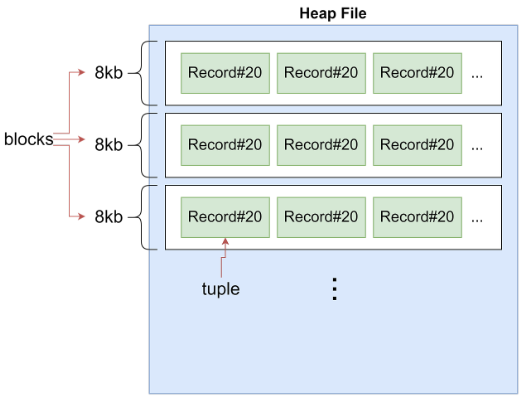
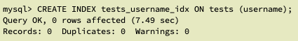
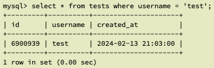
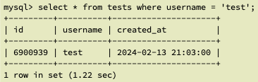

# [Database] Index

데이터베이스의 인덱스 (Index)에 대해 알아보기 전에 `Full Table Scan`에 대해 알아보겠습니다. Full table scan은 데이터베이스에서 데이터를 검색할 때 사용되는 한 가지 방법입니다. 이는 전체 테이블을 처음부터 끝까지 순차적으로 읽는 방식으로 이루어집니다.

<br>

# 📍 Full Table Scan

### ✔️ MySQL 동작 원리 간단히 알아보기

아래 예시를 통해 알아보겠습니다. 데이터베이스는 RDBMS의 MySQL을 기준으로 합니다.

```sql
SELECT * FROM users WHERE name = 'test';
```

위 쿼리는 `users` 테이블 내에 존재하는 데이터 중 `name` 컬럼에 대한 값이 `test` 인 데이터를 반환합니다. 이런 쿼리를 실행할 때 MySQL 내부에서는 어떤 일이 벌어지고 있을까요?

우선 데이터를 처리하기 위해 쿼리를 해석하고 분석하는 작업이 진행됩니다. 분석이 진행되면 테이블을 스캔할 것인지 아니면 지정된 인덱스를 사용할 것인지 결정합니다. 이 결정을 토대로 SQL 조건에 맞는 행만 선택하고 결과를 반환해줍니다.

### ✔️ 문제점

만약 `users` 테이블에 있는 데이터가 10억개라고 가정한다면, 데이터베이스 조회 속도는 굉장히 느려지게 됩니다. 그 이유는 아래와 같습니다:

- 모든 테이블의 각 행 (row)는 블록 데이터로 `Heap File` 에 저장됩니다.



테이블 하나에 대한 데이터는 하나의 `Heap File` 에 저장됩니다. 전체 데이터가 여러 개의 블록 (Block) 단위로 묶여서 저장되어 있기 때문에 MySQL 엔진이 바로 `Heap File` 에 접근해서 데이터를 스캔한다면 성능이 저하되고 I/O 비용이 크게 발생할 수 있습니다.

그래서 스캔 대상이 되는 모든 데이터를 메모리에 모아 두고 메모리에서 순차적으로 하나씩 확인을 하면서 쿼리의 조건에 맞는 데이터를 찾습니다. 이 작업은 테이블의 모든 블록이 모두 액세스 될 때까지 계속 수행하기 때문에 데이터의 전체 개수가 10억개라면 10억번 수행될 것입니다.

### ✔️ 요약

이처럼 `Heap File`로부터 **모든** 데이터를 메모리로 옮겨 데이터 하나하나 원하는 조건에 맞는지 확인하는 작업이 바로 **`Full Table Scan`**입니다. 데이터의 수가 적거나 테스트 환경이라면 테이블 전체를 조회하는 것은 전혀 문제가 되지 않습니다. 하지만 운영 중인 서비스 데이터베이스에 데이터 수가 많다면 다른 방식을 채택하는 것도 고민해 보아야 합니다.

<br>
<br>

# 📍 Index란?

```sql
SELECT * FROM users WHERE name = 'test';
```

위 쿼리와 같이 10억개의 데이터가 있는 `users` 테이블을 조회할 때 테이블 전체를 조회하는 Full Table Scan을 하지 않고 내가 원하는 `test` 데이터가 정확하게 어떤 Block의 몇 번째 인덱스에 존재하는지 알려줄 수 있는 방법은 없을까요?

`인덱스 (Index)`를 활용할 수 있습니다. Index는 데이터베이스 테이블에서 데이터 검색 작업의 속도를 향상시킬 수 있는 자료 구조를 가리킵니다.

Index를 책으로 빗대어 보겠습니다. 흔히 책의 목차를 인덱스 또는 색인이라고 표현하는데, 책의 각 장을 빠르게 찾아볼 수 있는 기능을 제공해줍니다. 클린코드 도서의 3장이 몇페이지부터 시작하는지 찾는다고 가정해 봅시다. 1페이지부터 3장이 나올 때까지 한장씩 넘기기 보다는 목차에서 3장이 시작하는 페이지를 바로 찾을 수 있어 시간 낭비를 덜 할 수 있겠네요.

데이터베이스의 Index 역시 마찬가지입니다. 내가 찾고자하는 데이터가 몇번째에 존재하는지 알려줍니다. 하지만 이런 Index는 자동으로 생성되지 않으며, 컬럼 (Column)을 기준으로 생성되기 때문에 생성할 때도 그 기준을 정해주어야 합니다.

### 자동으로 생성되는 Index가 있다?

데이터베이스 시스템마다 차이가 있을 수 있지만 직접 인덱스를 생성하지 않아도 자동으로 생성되는 경우가 있씁니다. MySQL에서는 아래 상황에서 자동으로 인덱스가 생성됩니다:

- 기본 키 (Primary Key) 혹은 유니크 (Unique) 제약 조건
- 외래 키 (Foreign Key) 제약 조건
- Index 힌트 사용
- etc.

<br>

## Index 생성 과정

데이터베이스 Index가 생성되는 과정부터 알아보겠습니다.

1. 수집
   - Index 생성 기준이 되는 Column의 데이터를 수집합니다. 위 쿼리를 기준으로 한다면 `name` Column을 기준으로 합니다.
   - Heap File에서 블록 데이터를 확인하면서 `name` 에 대한 데이터들만 수집하면서 몇번째 index에 존재하는지 데이터를 수집합니다.
2. 정렬
   - 데이터 수집을 마치면, 데이터를 정렬합니다.
   - 데이터 (row)가 문자열인 경우 알파벳 순으로 정렬합니다. 숫자/날짜 등의 값은 오름차순 혹은 내림차순으로 정렬할 수 있습니다.
3. Tree

   `트리 (Tree)`란 노드들이 나무 가지처럼 연결된 비선형 계층적 자료구조입니다. 대부분의 데이터베이스 시스템에서는 B-트리 구조를 사용하여 인덱스를 생성합니다.

   - 정렬된 데이터를 트리 구조로 정리합니다.
   - 데이터를 가장 왼쪽 노드부터 오른쪽으로 순서대로 추가합니다.
     - 정렬된 데이터를 Tree 구조에서 가장 왼쪽의 Leaf Node부터 순서대로 오른쪽으로 추가합니다.
     - Leaf Node들만 확인해도 왼쪽에서 오른쪽으로 기존의 정렬 상태가 유지됩니다.
   - 루트 노드에는 조건에 따라 방향을 말해주는 헬퍼 (helper)를 추가합니다.
     - Root Node에는 조건에 따라 방향을 말해주는 Helper를 추가합니다.
     - Helper는 어떤 Leaf Node를 확인해야 하는지 알려주어, 조건에 맞는 데이터를 담고 있는 Leaf Node만 확인하면 됩니다.
     - 다른 Leaf Node를 확인할 필요가 없도록 도와줍니다.

<br>

## Index 동작 방식

Index가 생성된 이후 실제로 데이터를 조회할 때 Index가 사용되는 과정은 다음과 같습니다. 위의 쿼리에서 찾을 데이터 (row)는 `test` 입니다.

1. 루트 노드 (Root Node)에서 좌측 조건에 맞지 않으니 우측 조건을 살펴본 뒤 해당 조건에 맞는지 확인합니다.
2. 우측 리프 노드 (Leaf Node)에서 미리 수집해놓은 `test`란 `name`을 가진 데이터의 위치(Block, Index)를 파악합니다.
3. Heap file에서 해당 위치에 있는 데이터를 찾습니다.

조건에 맞는 데이터가 어디에 있는지 말해주는 루트 노드의 헬퍼 (helper)**를** 이용하여 **좌측 리프**는 확인할 필요도 없이 **우측 리프 노드**만 확인하면 됩니다.

그리고 해당 리프 노드에서 찾는 데이터가 **Heap File**의 **Block 1**에 있다는 사실을 알고 **Block 0**는 확인할 필요도 없이 원하는 데이터를 찾을 수 있는 것입니다.

**Full Table Scan**처럼 원하는 데이터를 찾을 때까지 모든 데이터를 메모리에 로드한 뒤 하나씩 확인하는 방식보다 속도면에서 큰 이점이 있습니다.

<br>

## 언제, 왜 Index를 활용해야 하는가?

데이터베이스 인덱스를 사용하는 주요 목적은 다음과 같습니다:

1. 데이터의 검색이 빈번한 경우
   - 검색 쿼리의 빈도가 높은 열에 인덱스를 생성하면 검색 속도를 크게 향상시킬 수 있습니다.
   - WHERE 절에서 사용되거나 JOIN에 활용되는 Column 등
2. 대용량 테이블에서의 검색 성능 향상이 필요할 때
   - 대용량 테이블에서는 모든 데이터를 스캔하는 것이 비용이 높습니다. 인덱스를 사용하면 일부만 읽고 필요한 데이터에 빠르게 접근할 수 있습니다.
3. 정렬 및 그룹화 작업에서 성능 향상이 필요할 때
   - ORDER BY나 GROUP BY와 같은 정렬 또는 그룹화 작업에서도 인덱스는 효과적입니다. 정렬된 상태로 데이터에 접근할 수 있기 때문입니다.
4. 유니크나 외래키 속성에 빠른 검색이 필요할 때
   - 인덱스를 통해 유니크한 값을 빠르게 찾을 수 있고, 외래 키 관계에서 JOIN을 효율적으로 수행할 수 있습니다.

<br>

## Index는 반드시 써야하는가?

데이터베이스 Index를 사용하면 쿼리 성능이 좋아지고 조회 속도가 더 빨라진다는 장점이 있기 때문에 모든 Column에 대해 Index를 지정하면 된다는 생각은 오히려 부작용을 초래할 수 있습니다. 오히려 크게 도움이 되지 않거나 비효율적일 수도 있습니다.

1. Index도 저장공간을 차지한다.
   - 인덱스도 마찬가지로 컴퓨터의 저장 공간을 사용합니다. 요즘처럼 데이터베이스도 호스팅 해서 비용을 지불하고 사용하는 시대에 과연 늘어나는 저장공간에 대한 금액을 매번 내는 게 부담스럽지 않을지도 생각해봐야 하는 문제입니다.
2. 데이터 업데이트
   - Index는 생성 시점에 해당 테이블에 존재하는 데이터를 기준으로 생성되기 때문에 테이블에 데이터가 추가, 업데이트, 삭제될 때마다 인덱스도 업데이트해줘야 합니다.
   - 20개의 데이터를 따로따로 INSERT 한다고 가정한다면 인덱스도 20번 업데이트 해주어야 합니다.
3. 적절한 Index 선택
   - 어떤 열에 인덱스를 생성할지 신중하게 선택해야 합니다. 너무 많은 인덱스는 오히려 성능을 저하시킬 수 있습니다.

인덱스를 사용할지 여부는 데이터베이스의 특성, 쿼리 패턴, 응용 프로그램의 요구 사항 등을 고려하여 결정해야 합니다.

<br>
<br>

# 📍 Index 생성 실습

MySQL을 기준으로 Index를 실제로 생성해보겠습니다.

[tests.sql](https://s3-us-west-2.amazonaws.com/secure.notion-static.com/1dded271-ecd4-4a07-818b-64bbdf94df94/index_demo.sql)

### ✔️ MySQL dump하기

위 파일을 다운로드 받고 해당 디렉토리로 이동하여 아래 명령어를 실행합니다.

```bash
$ mysql -u root -p database_name < index_demo.sql
```

### ✔️ Index 생성하기

아래 SQL문을 이용하여 인덱스를 생성해줍니다. 테스트를 위해 생성한 데이터베이스 이름은 `index_test` 이며, 테이블은 `tests` 로 지정하겠습니다. 인덱스 이름은 `tests_username_idx` 로 설정해보겠습니다.

```sql
# CREATE INDEX 인덱스_이름 ON 테이블_이름 (컬럼명)
CREATE INDEX tests_username_idx ON tests (username);
```



데이터의 개수가 많아 Index를 생성하는데 약 7.5초가 소요된 것을 확인할 수 있습니다.

### ✔️ Index 삭제하기

Index를 삭제하는 방법은 다음과 같습니다.

```sql
# DROP INDEX 인덱스명 ON 테이블명;
DROP INDEX tests_username_idx ON tests;
```

### ✔️ 속도 비교하기

Index를 사용했을 때와 사용하지 않았을 때의 속도를 비교해보겠습니다.

SQL문은 아래와 동일합니다.

```sql
SELECT * FROM tests WHERE username = 'test';
```

- Index를 사용하여 데이터를 조회한 경우



- Index를 사용하지 않고 데이터를 조회한 경우



약 1초 가량 차이가 발생하는 것을 확인할 수 있습니다. 서비스를 운영함에 있어서 1초의 시간을 줄이는 것은 대규모 트래픽을 처리할 때 큰 성과를 낼 수 있기 때문에 Index를 잘 활용한다면 서비스 성능 개선에 도움이 될 것 같습니다.
