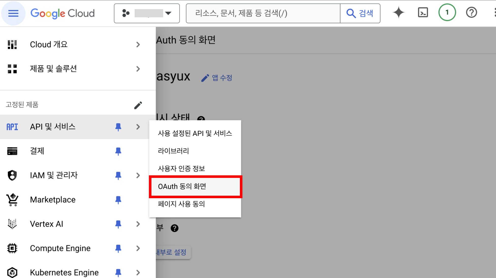

# Node 개발 환경에서 이메일 보내기 (feat. SMTP, POP3, IMAP)

> 웹 서비스를 개발하다보면 사용자에게 안내 메일을 발송하거나 인증에 필요한 코드를 전송하기 위해 이메일을 보내야 하는 순간이 있을 것입니다. 이메일을 발송할 수 있는 다양한 기능들에 대해 알아보고 실무에서는 어떻게 접목했는지, 어떻게 발전시킬 수 있는지 알아보도록 하겠습니다.

<br>

# 📍 이메일은 어떻게 보내고 받나요?

이메일을 발송하는 코드도 중요하지만 이메일을 발송할 때 뒷단의 서버들이 어떻게 동작하는지도 알아보면 좋을 것 같습니다. 실제 이메일을 발송하고 수신하는 프로젝트를 진행하는 것이 아니라면 보통은 이메일을 발송하는 기능을 주로 구현하게 될 것입니다. 그래도 이메일이 보내지고 수신되는 그 과정을 간단하게 보고 코드도 천천히 훑어보겠습니다.

이메일 발송과 수신은 _발신자 메일 클라이언트 → 발신자 메일 서버 → 수신자 메일 서버 → 수신자 메일 클라이언트_ 흐름으로 이루어집니다.

- 발신자 메일 클라이언트: 사용자가 이메일을 보내고 받는 프로그램 (e.g., 구글, 네이버)
- 발신자 메일 서버: 이메일 발송을 담당하는 서버 (e.g., 구글 or 네이버 서버)
- 수신자 메일 서버: 이메일 발송을 수신하는 서버 (e.g., 구글 or 네이버 서버)
- 수신자 메일 클라이언트: 사용자가 이메일을 받는 프로그램 (e.g., 구글, 네이버)

### ✔️ SMTP

이메일 발송 기능을 구현할 때 가장 많이 접하는 개념이 바로 `SMTP`입니다. SMTP는 Simple Mail Transfer Protocol의 약자로 인터넷을 통해 이메일을 보내는데 사용되는 통신 프로토콜입니다. 주요 역할은 이메일을 전송하는 역할을 담당하고 있으며, 발신자 메일 클라이언트에서 이메일을 작성하고 보낼 때 발신자 메일 서버 (SMTP)에서 수신자 메일 서버로 이메일을 전달하게 됩니다.

- 작동 방식은 다음과 같습니다:

1. 사용자가 이메일을 작성하여 보내면, SMTP 서버는 이를 수신자 메일 서버로 전달합니다.
2. SMTP는 주로 발신자 메일 서버와 수신자 메일 서버 간의 이메일 전송을 처리합니다.

### ✔️ POP3

SMTP는 이메일 발송을 담당하는데요. 이메일은 누군가 읽어야 하기 때문에 수신을 담당하는 프로토콜도 필요합니다. 그 중 하나가 POP3로 Post Office Protocol (version 3)입니다. 이 POP3는 수신자 메일 서버로 발송된 이메일을 수신자 메일 클라이언트로 가져올 때 사용되며, 로컬 장치에 이메일을 저장하는 프로토콜입니다. 이메일을 한번 다운로드하게 되면 이메일을 관리하는 서버에서 삭제도 할 수 있습니다.

- 작동 방식은 다음과 같습니다:

1. 수신자 메일 클라이언트는 POP3 서버에 연결하여 수신자 메일 서버에 저장된 이메일을 다운로드합니다.
2. 다운로드된 이메일은 클라이언트의 로컬 장치에 저장됩니다. (서버에서 이메일이 삭제될 수 있으며 이 설정은 클라이언트에서 조정할 수 있습니다.)
3. 이메일의 상태(읽음, 안 읽음 등)는 클라이언트에만 반영되며, 서버에는 영향을 미치지 않습니다.

### ✔️ IMAP

이메일 수신을 담당하는 또 하나의 프로토콜이 있습니다. IMAP이라는 프로토콜인데요. Internet Message Access Protocol의 약자입니다. IMAP은 POP3와 이메일을 수신하는 역할에서 유사한 점을 보이지만, 이메일을 직접 관리할 수 있다는 다른 기능도 있는데요. 이메일을 서버에 저장한 채로 수신자 메일 클라이언트에서 이메일을 직접 관리할 수 있으며, 수신자 메일 서버에 접근하여 읽기, 삭제, 이동 등의 행동을 클라이언트에서 수행할 수 있도록 해줍니다.

- 작동 방식은 다음과 같습니다:

1. 클라이언트는 IMAP 서버에 연결하여 서버에 저장된 이메일에 접근하고, 읽고, 폴더를 관리할 수 있습니다.
2. 이메일은 서버에 남아 있으므로, 여러 장치에서 동일한 이메일을 동기화하고 관리할 수 있습니다.
3. 클라이언트에서의 이메일 상태 변경(읽음, 안 읽음, 폴더 이동 등)은 서버에 즉시 반영되어 모든 장치에서 동일한 상태를 유지합니다.

### ✔️ 비슷해보이는 POP3와 IMAP은 언제 사용할까?

이메일을 수신한다는 부분에서 POP3와 IMAP 프로토콜은 동일한 역할을 수행할 수 있지만, 저장 방식에 따라 기능을 다르게 구현할 수 있을 것 같습니다. 실제로 구현하는 애플리케이션의 목적에 맞게 구현하는 것이 가장 중요할텐데요. 기준이 될 수 있는 간단한 사례를 들어 비교해보고자 합니다.

POP3는 실제 사용자의 디바이스에 이메일을 저장하는 방식입니다.

- 오프라인 상태에서도 메일이 확인이 필요한 경우
- 용량이 큰 메일을 자주 주고받아 주기적으로 용량을 관리해야 할 때

IMAP는 메일 서버와 이메일을 동기화할 수 있습니다.

- 다중 디바이스 환경에서 이메일 관리가 필요한 경우
- 불필요한 메일을 다운로드 하지 않고 필요한 메일만 확인해야 하는 경우

<br>

# 📍 Google Cloud Gmail API

이제 이메일을 서버에서 어떻게 주고 받는지 대충 알아보았으니, 실제로 기능을 구현하기 위해 API를 연동해볼텐데요. 주로 사용하는 API 중 하나인 GMail API를 사용하는 방법과 Node 런타임 환경에서 JavaScript 코드 예제를 같이 작성해보겠습니다.

### ✔️ Google Cloud 설정

우선 GMail API를 사용하기 위해 구글 개발자 콘솔에 들어가 Google Cloud 프로젝트를 생성해줍니다.

### 1. Google Cloud 프로젝트 생성

- [Google Cloud](https://console.cloud.google.com/welcome)

위 링크로 접속했을 때 기존 프로젝트가 있다면 아래 화면처럼 보일텐데요. 기존 프로젝트가 있는 경우 새 프로젝트를 생성하거나 API를 추가하면 됩니다. 만약 프로젝트가 없으면 새 프로젝트를 생성해줍니다.


### 2. API 서비스 사용하기

프로젝트를 생성한 뒤 왼쪽 메뉴탭에서 *API 및 서비스 - 사용 설정된 API 및 서비스*를 클릭합니다.


### 3. GMail API 사용하기

그 다음 나오는 화면에서 Gmail API를 검색하여 아래 화면에서 `사용` 버튼을 클릭합니다. (아래는 이미 사용 중인 API로 `관리`로 대체되어 있습니다.)


### 4. OAuth 동의 화면 이동

다시 왼쪽 메뉴 탭을 눌러 *API 및 서비스 - OAuth 동의 화면*을 클릭합니다.



### 5. OAuth 동의 화면 - 앱 정보

앱 정보를 입력합니다.

- 앱 이름: 사용 중인 애플리케이션의 이름을 입력해줍니다.
- 사용지 지원 이메일: 사용자를 인증할 수 있는 이메일을 입력해줍니다.


### 6. OAuth 동의 화면 - 앱 도메인

앱 도메인을 입력합니다.

- 애플리케이션 홈페이지: 배포 중인 애플리케이션의 홈페이지 url 주소를 입력합니다.
- 개인정보처리방침 링크: 애플리케이션의 개인정보처리방침을 확인할 수 있는 url 주소를 입력합니다. (선택)
- 서비스 약관 링크: 애플리케이션의 서비스 약관 링크를 확인할 수 있는 url 주소를 입력합니다. (선택)


### 7. OAuth 동의 화면 - 승인된 도메인

승인된 도메인과 개발자 연락처 정보를 입력합니다.


### 8. 사용자 인증 정보 - 승인된 리디렉션 URI

승인된 리디렉션 URI를 입력합니다. 애플리케이션 서버에서 API를 요청할 떄 사용자 인증에 필요한 리디렉션 URI입니다. 해당 링크를 통해 Google OAuth2.0 토큰을 요청하고 갱신할 수 있으며 필요 시 Google API 호출 테스트를 진행할 수 있습니다.

```
https://developers.google.com/oauthplayground
```


### 9. 사용자 인증 정보 - 클라이언트 정보

입력이 완료되면 사용자 인증정보를 확인합니다. json 파일로도 다운로드 받아 관리할 수 있습니다. 클라이언트 ID와 클라이언트 보안 비밀번호는 OAuth2.0 인증에 필요한 정보이기 때문에 외부 유출에 신경써서 관리하면 됩니다.


### 10. OAuth2.0 Playground - Configuration

- [OAuth2.0](https://developers.google.com/oauthplayground/)

이제 OAuth2.0 Playground 링크로 접속하여 Gmail API 호출에 필요한 RefreshToken을 발급합니다. 9번 단계에서 진행한 config 설정 정보를 입력해줍니다.


### 11. OAuth2.0 Playground - Select APIs

다음으로 API 인가 단계를 거칩니다. 좌측 검색창에서 아래 주소를 검색하거나 GMail API를 직접 찾아 Authorize APIs 버튼을 클릭합니다.

```
https://mail.google.com/
```


### 12. OAuth2.0 Playground - RefreshToken

Authorization code가 출력되었다면 해당 코드를 통해 refresh token을 발급할 수 있습니다.


<br>

### ✔️ Node (Javascript) API 사용 예제

여느 API 호출 방식과 동일합니다. 공식문서를 참조하기 바랍니다.

<br>

# 📍 Nodemailer

Gmail API를 호출하여 이메일을 발송하는 방법도 물론 좋은 방식입니다. 하지만 client 설정을 따로 해야하거나, 직접 이메일 발송에 대한 세부 조건을 설정해야 하는 복잡성이 존재합니다.

너무나 고맙게도 이런 복잡한 과정을 해결해준 무료 패키지가 있는데요. Node 개발자라면 한번쯤은 들어봤을 법한 `nodemailer`입니다.

Gmail SMTP 서버를 활용하여 이메일을 발송하기 때문에 Google Cloud 설정을 미리 해두는 것이 좋습니다. 또한 Google 이메일과 비밀번호 (앱)로 사용자 인증을 설정하는 방법도 있으나 보안에 상대적으로 취약하기 때문에 OAuth2.0 방식으로 사용자 인증을 하는 것을 권장합니다.

### ✔️ Install

nodemailer를 프로젝트 디렉토리에서 설치해줍니다.

```
$ npm install nodemailer
```

### ✔️ Example

JavaScript 코드를 기반으로 설명하겠습니다.

1. Configuration transports

nodemailer에서 SMTP

- auth (the authentication object)
  - `*type`: 인증 타입 ('OAuth2')
  - `*user`: 구글 이메일
  - `*clientId`: 애플리케이션 클라이언트ID
  - `*clientSecret`: 애플리케이션 클라이언트 비밀 키
  - `refreshToken`: OAuth2.0 Playground에서 받은 RefreshToken. (200일)
  - `accessToken`: RefreshToken이 유효하지 않을 때 반드시 필요한 값으로 OAuth2.0 accessToken
  - `expires`: accessToken 값이 존재할 경우 필요한 토큰 만료기간
  - `accessUrl`: 새 accessToken을 발급하기 위한 HTTP 엔드포인트

```javascript
const nodemailer = require("nodemailer");

export const transports = nodemailer.createTransport({
  service: "gmail",
  host: "smtp.google.com",
  port: 587,
  auth: {
    type: "OAuth2",
    user: "YOUR_EMAIL@gmail.com",
    clientId: process.env.CLIENT_ID,
    clientSecret: process.env.CLIENT_SECRET,
    refreshToken: process.env.REFRESH_TOKEN,
  },
});
```

2. Send Email

위에서 구성한 transport 정보로 nodemailer 모듈을 초기화하고 메일을 발송하는 메서드를 호출하는 함수는 아래처럼 구현할 수 있습니다.

```javascript
async sendEmail = () => {
  const mailOption = {
    from: 'sender@email.com',
    to: 'receiver@email.com',
    subject: 'email-title',
    html: 'html-file'
  };

  const response = await transports.sendEmail(mailOption);
  console.log(response);

  return true // return Appropriate type for this function!
}
```

<br>

# 📍 AWS Lambda (feat. SNS)

서버에서 메일을 직접 발송하다보면 발송되는 시간이 느리다는 것을 확인할 수 있습니다. 발송하는 HTMl의 용량 문제일 수도 있고, 서버 문제일 수도 있으나 이러한 의존성을 서버에 둔다면 유저들은 메일이 발송되지 않았다고 착각하여 보내기 버튼을 2회 3회 클릭할 수도 있습니다.

이러한 문제점을 개선하기 위해 AWS 서비스를 사용하는 방안에 대해서도 고려해보았습니다. 실제로 기능을 구현하진 않았고 설계한 아키텍쳐에 대해 공유하고자 합니다. (언젠간 개발할 수도,,,)

### ✔️ 아키텍처 개요


아키텍처 개요는 다음과 같습니다. 구현 예제는 프로젝트, 프레임워크에 따라 상이할 수 있습니다.

1. 애플리케이션 서버는 클라이언트 (유저)의 이메일 발송 HTTP 요청을 받습니다.
2. nodemailer 혹은 API를 직접 호출하지 않고 AWS SNS 메시지를 퍼블리시합니다.

애플리케이션 내부에서 AWS SDK를 사용하여 SNS에 메시지를 퍼블리시하는 코드 예제입니다.

```javascript
// api-service.js
const AWS = require("aws-sdk");
const sns = new AWS.SNS({ region: "region" });

async function sendMessageToSNS(emailDetails) {
  try {
    const params = {
      Message: JSON.stringify(emailDetails),
      TopicArn: "arn:aws:sns:region:123456789012:MyTopic",
    };

    const result = await sns.publish(params).promise();
  } catch (error) {
    console.error("Error sending message to SNS:", error);
  }
}

/**
 *  Call Function with specific example data
 */
const emailDetails = {
  to: "recipient@example.com",
  subject: "Test Email",
  text: "This is a test email sent from AWS Lambda!",
};

sendMessageToSNS(emailDetails);
```

3. AWS Lambda는 SNS로부터 메시지를 수신하고 이메일 발송하는 함수를 실행합니다.

AWS Lambda 함수가 SNS로부터 메시지를 수신하고 Nodemailer를 사용하여 이메일을 발송할 수 있습니다. nodemailer의 transport를 설정하는 상세 코드는 생략하겠습니다.

```javascript
exports.handler = async (event) => {
  const snsMessage = event.Records[0].Sns.Message;
  const transports = nodemailer.createTransport({ ...configs });
  const mailOptions = { ...mailOptions };

  return await transports.sendEmail(mailOption);
};
```

### 보완?

- AWS Lambda 함수를 작성하고 관리하는 것이 비효율적이라면 이메일 자체를 발송하는 SES (Simple Email Services)를 사용하는 것도 하나의 대안이 될 수도 있겠습니다.

<br>
<br>

---

### 참고자료

- [AWS - SMTP](https://aws.amazon.com/ko/what-is/smtp/)
- [gmail-api-docs](https://developers.google.com/gmail/api/quickstart/nodejs?hl=ko)
- [IMAP 및 POP란?](https://support.microsoft.com/ko-kr/office/imap-%EB%B0%8F-pop-%EC%9D%B4%EB%9E%80-ca2c5799-49f9-4079-aefe-ddca85d5b1c9)
