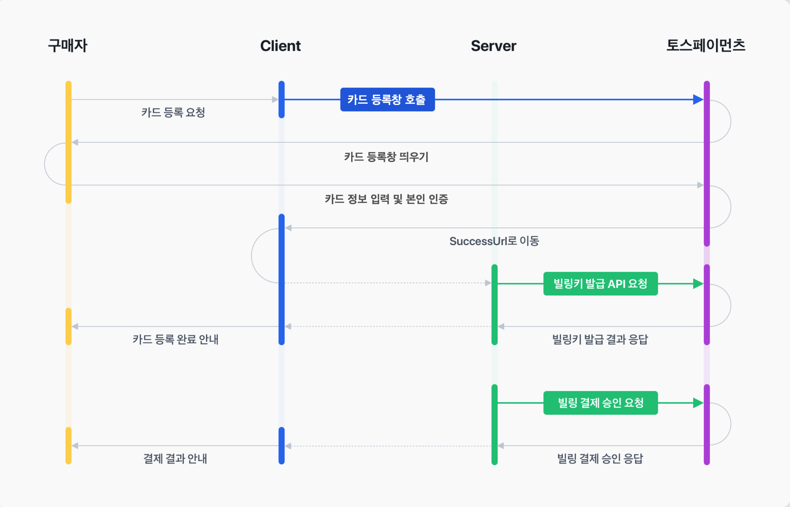
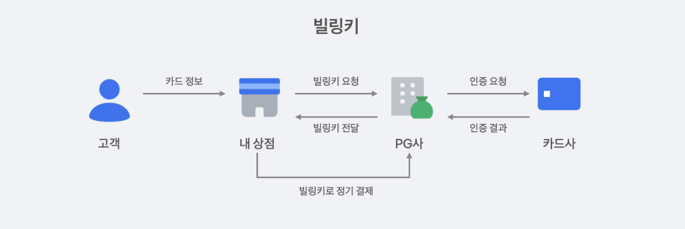

# ⚙️ 1. config

아래 정보는 테스트 정보로 실제 계약 및 심사가 종료되면 발급되는 정보로 변경해야 합니다.

```javascript
// API 개별 테스트 연동 키
// 토스페이먼츠에 회원가입하기 전이라면 아래 키는 문서 테스트 키입니다.
// 토스페이먼츠에 회원가입하고 로그인한 상태라면 아래 키는 내 테스트 키입니다.
const clientKey = "test_ck_26DlbXAaV0Okl0NRPDBd3qY50Q9R";
const secretKey = "test_sk_yZqmkKeP8gB6xaJL0B1KrbQRxB9l";
```

# 📍2. Frontend



## ✨ 2-1. SDK 결제창 구현

- **clientId** - 브라우저에서 SDK 연동할 때 클라이언트를 식별하기 위한 정보 (config.clientKey)
- **customerKey** - 구매자 ID로 빌링키와 연동되는 정보 (userId: ObjectID 사용 예정)

## ✨ 2-2. 카드 결제 정보 등록하기

### ✔️ 1. 결제창에서 카드 정보 입력하기

- 카드번호 (개인카드 vs 법인카드)
- 유효기간
- 이름
- 주민등록번호 앞6자리 + 뒤1
- 통신사 + 전화번호

### ✔️ 2. 결제 인증 성공 여부에 따라 리다이렉트URL로 이동

- 성공 - successUrl (**아래 두 파라미터 서버로 전달 필요**)
  - `cusotmerKey` - 구매자ID
  - `authKey` - 빌링키 발급에 필요한 일회성 인증키 (최대 300자)
- 실패 - failUrl → 에러페이지 렌더링

<br>

# 📍3. Backend


## ✨ 3-1. 빌링키 발급받기

### ✔️ 빌링키



- 빌링키는 카드번호, 유효기간, CVC 등 결제 정보를 고유 식별 토큰으로 매핑하고 그 매핑된 값을 암호화한 값.
- 유효기간은 카드의 유효기간과 동일
- 발급된 빌링키를 삭제하는 기능은 없음. 필요없는 경우 DB에서 삭제하면 됨 (유저 탈퇴 등)
- 구매자의 카드 정보 대신 빌링키를 사용하여 구독 결제 시점에 결제하는 원리

### ✔️ 요청 예시

```typescript
const API_SECRET_KEY = config.secretKey + ":";
const AUTHORIZATION = Buffer.from(API_SECRET_KEY).toString("base64");
const PG_API_URL = "https://api.tosspayments.com/v1/billing/authorizations/issue";

const options = {
  method: "POST",
  url: PG_API_URL,
  headers: {
    Authorization: `Basic ${authKey}`,
    "Content-Type": "application/json",
  },
  data: {
    authKey,
    customerKey,
  },
} as AxiosRequestConfig;

return await axios.request(options);
```

### ✔️ 응답 예시

- 빌링키와 customerKey를 매핑하여 DB에 저장빌링키가 노출되어도 customerKey를 모르면 결제 불가능

```javascript
200 OK
{
  "mId": "tosspayments",
  "customerKey": "2r3HRVo4wjzWQygiHjKwU",
  "authenticatedAt": "2021-01-01T10:00:00+09:00",
  "method": "카드",
  "billingKey": "Z_t5vOvQxrj4499PeiJcjen28-V2RyqgYTwN44Rdzk0=",
  "card": {
    "issuerCode": "61",
    "acquirerCode": "31",
    "number": "43301234****123*",
    "cardType": "신용",
    "ownerType": "개인"
  },
  "cardCompany": "현대",
  "cardNumber": "43301234****123*"
}
```

## ✨ 3-2. 카드 자동결제 승인 요청

- 발급받은 빌링키로 카드 자동 결제 요청 및 승인합니다.
- 최대 30초까지 소요되니 타임아웃 값을 최소 30초로 설정해야 한다.

### ✔️ 요청 예시

```typescript
const API_SECRET_KEY = config.secretKey + ':';
const AUTHORIZATION = Buffer.from(API_SECRET_KEY).toString('base64');
const PG_API_URL = 'https://api.tosspayments.com/v1/billing/authorizations/issue'

const options = {
	method: 'POST',
	url: PG_API_URL,
	headers: {
		Authorization : `Basic ${authKey}`,
		'Content-Type': 'application/json'
	},
	data: {
	  customerKey: "customerObjectId", // 구매자ID*
	  amount: 4900,  // 결제할 금액*
	  orderId: "a4CWyWY5m89PNh7xJwhk1", // 주문번호 (무작위한 값)*
	  orderName: "더 쉽게", // 구매상품*
	  customerEmail: "sangwoong@twominutes.co.kr", // _구매자 이메일
	  customerName: "김상웅", // _구매자 이름
	  taxFreeAmount: 0, // _면세 금액 (없거나 0)
	  taxExemptionAmount: 0 // 과제 제외 결제 금액
	  cardInstallmentPlan: 0 // 신용 카드 할부 개월 (2~12)
	}
} as AxiosRequestConfig

return await axios.request(options)
```

### ✔️응답 예시

```javascript
{
  "mId": "tosspayments",
  "lastTransactionKey": "798780972A6B30495E2DAB97839D1199",
  "paymentKey": "y05n91dEvLex6BJGQOVDpgDQ0gDv0QVW4w2zNbgaYRMPoqmD",
  "orderId": "a4CWyWY5m89PNh7xJwhk1",
  "orderName": "더 쉽게",
  "taxExemptionAmount": 0,
  "status": "DONE",
  "requestedAt": "2024-02-13T14:54:34+09:00",
  "approvedAt": "2024-02-13T14:54:57+09:00",
  "useEscrow": false,
  "cultureExpense": false,
  "card": {
    "company": "롯데",
    "issuerCode": "71",
    "acquirerCode": "71",
    "number": "51379200****061*",
    "installmentPlanMonths": 0,
    "isInterestFree": false,
    "interestPayer": null,
    "approveNo": "00000000",
    "useCardPoint": false,
    "cardType": "신용",
    "ownerType": "개인",
    "acquireStatus": "READY",
    "receiptUrl": "https://dashboard.tosspayments.com/receipt/redirection?transactionId=tviva20240213145434Rycs6&ref=PX",
    "provider": "토스결제",
    "amount": 4900
  },
  "virtualAccount": null,
  "transfer": null,
  "mobilePhone": null,
  "giftCertificate": null,
  "cashReceipt": null,
  "cashReceipts": null,
  "discount": null,
  "cancels": null,
  "secret": null,
  "type": "BILLING",
  "easyPay": null,
  "easyPayAmount": 0,
  "easyPayDiscountAmount": 0,
  "country": "KR",
  "failure": null,
  "isPartialCancelable": true,
  "receipt": {
    "url": "https://dashboard.tosspayments.com/receipt/redirection?transactionId=tviva20240213145434Rycs6&ref=PX"
  },
  "checkout": {
    "url": "https://api.tosspayments.com/v1/payments/y05n91dEvLex6BJGQOVDpgDQ0gDv0QVW4w2zNbgaYRMPoqmD/checkout"
  },
  "transactionKey": "798780972A6B30495E2DAB97839D1199",
  "currency": "KRW",
  "totalAmount": 4900,
  "balanceAmount": 4900,
  "suppliedAmount": 4455,
  "vat": 455,
  "taxFreeAmount": 0,
  "method": "카드",
  "version": "2022-11-16"
}
```

## ✨ 3-3. 정기 결제 구현

빌링키를 통해 결제를 실행하고 결제가 정상적으로 이루어졌는지 먼저 확인해주세요. 이후 쉽게 결제 정책에 따라 반복해서 결제를 실행하는 로직을 구성해야 합니다.

### ✔️ cron 표기법 이해하기 - (출처: [Wiki cron](https://ko.wikipedia.org/wiki/Cron))

> 소프트웨어 유틸리티 **cron**은 [유닉스 계열](https://ko.wikipedia.org/wiki/%EC%9C%A0%EB%8B%89%EC%8A%A4_%EA%B3%84%EC%97%B4) 컴퓨터 [운영 체제](https://ko.wikipedia.org/wiki/%EC%9A%B4%EC%98%81_%EC%B2%B4%EC%A0%9C)의 시간 기반 [잡 스케줄러](https://ko.wikipedia.org/w/index.php?title=%EC%9E%A1_%EC%8A%A4%EC%BC%80%EC%A4%84%EB%9F%AC&action=edit&redlink=1)이다. 소프트웨어 환경을 설정하고 관리하는 사람들은 작업을 고정된 시간, 날짜, 간격에 주기적으로 실행할 수 있도록 스케줄링하기 위해 cron을 사용한다.

```jsx
# ┌───────────── min (0 - 59)
# │ ┌────────────── hour (0 - 23)
# │ │ ┌─────────────── day of month (1 - 31)
# │ │ │ ┌──────────────── month (1 - 12)
# │ │ │ │ ┌───────────────── day of week (0 - 6) (0 to 6 are Sunday to Saturday, or use names; 7 is Sunday, the same as 0)
# │ │ │ │ │
# │ │ │ │ │
  * * * * *  command to execute

// 예시
cron( 0 0 1 * * )
- 0: 0초 (생략 시 0초로 간주)
- 0: 0분
- 0: 0시 (자정)
- 1: 매월 1일
- *: 매월
- *: 매 요일
```

사내에서는 NestJS 프레임워크를 사용하고 있기 때문에 cron 사용법을 알아두면 좋습니다. 스케줄링을 할 수 있는 `schedule` 모듈을 제공하고 있고 해당 모듈을 사용하여 정기 결제에 필요한 코드를 작성할 예정입니다.

데이터베이스 설계, API 스펙 정의, 실제 비즈니스 로직 등에 대해서도 상세하게 다뤄보겠습니다.

<br>

---

### 출처

- [토스페이먼츠 - 정기결제(빌링) 가이드](https://docs.tosspayments.com/guides/billing/overview)
- [토스페이먼츠 - 구독 결제 서비스 구현하기 (1) 빌링키 발급](https://docs.tosspayments.com/blog/subscription-service-1)
- [토스페이먼츠 - 구독 결제 서비스 구현하기 (2) 스케줄링](https://docs.tosspayments.com/blog/subscription-service-2#%EA%B5%AC%EB%8F%85-%EA%B2%B0%EC%A0%9C-%EC%84%9C%EB%B9%84%EC%8A%A4-%EA%B5%AC%ED%98%84%ED%95%98%EA%B8%B0-2-%EC%8A%A4%EC%BC%80%EC%A4%84%EB%A7%81)
- [NestJS - Task Scheduling](https://docs.nestjs.com/techniques/task-scheduling)
