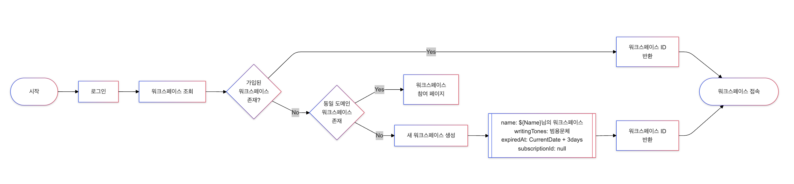
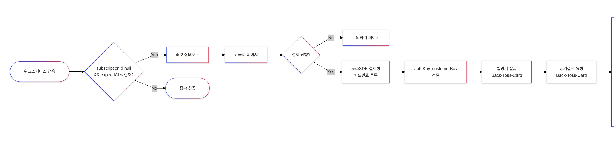
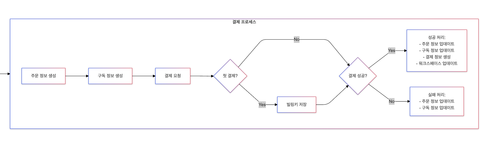

# 📍 1. 정기결제 - 설계 (카드등록~첫결제)

정기결제를 연동할 때 어떤 플로우를 추가해야 하고 기존의 플로우 중에서 수정해야 할 부분이 어디인지 고민을 많이했는데요.

이번 포스팅에서는 간단한 데이터베이스 스키마와 백엔드 프로세스, 카드를 등록하고 빌링키를 발급하는 과정, 발급받은 빌링키로 첫 정기 결제를 실행하는 프로세스에 대해 설명해보려고 합니다.

### ✔️ 로그인 ~ 워크스페이스 접속

로그인부터 워크스페이스에 접속하는 프로세스는 다음과 같이 정리했습니다. 기존 프로세스에 결제 기능을 고려하지 않았기 때문에 결제 여부를 판단할 수 있는 플래그를 추가해 주어야 하는 소요가 발생했습니다.



### ✔️ 워크스페이스 접속 ~ 결제

서비스를 이용하기 위해서는 결제가 반드시 필요했습니다. 일정 기간이 지난 이후 결제를 위해 카드 등록을 하는 과정이 필요했으며, 카드 등록 이후 선택한 요금제에 따라 정기결제가 실행되는 프로세스를 구상했습니다.



### ✔️ 결제 프로세스

실제 결제가 진행되면서 필요한 내부 로직을 구상했습니다. 구독 정보와 주문 정보가 일치할 수도 있을 것이라는 고민도 했지만 요금제의 확장성을 고려하여 주문 정보도 생성하도록 설계를 했습니다. 토스페이먼츠의 결제 성공 여부에 따라 다른 프로세스를 거치는 과정이 주요 로직이 될 것 같습니다.



<br>

# 📍 2. 클라이언트

토스페이먼츠 개발 공식문서에서는 개발 환경에 필요한 다양한 코드 템플릿을 제공하고 있습니다. 클라이언트 개발을 하는데 많은 시간을 투자할 수 없기 때문에 아래 코드 템플릿을 적극적으로 이용했습니다.

아래 코드를 실행하면 간편하게 결제창을 구현할 수 있습니다. 개발을 하면서 테스트 결제창을 실행하기 위해서 아래 두가지 값을 입력해주면 됩니다.

### ✔️ 필요한 값

- `clientKey` - 토스페이먼츠에 로그인하면 볼 수 있는 테스트 클라이언트키입니다.
- `successUrl` - 카드 등록에 필요한 `customerKey`와 `authKey`를 반환받을 수 있는 콜백URL입니다. 보통 웹 서버의 엔드포인트를 작성합니다.

### ✔️ 예시 HTML

```HTML
<!DOCTYPE html>
<html lang="ko">
  <head>
    <meta charset="utf-8" />
    <!-- SDK 추가 -->
    <script src="https://js.tosspayments.com/v2/standard"></script>
  </head>
  <body>
    <!-- 카드 등록하기 버튼 -->
    <button class="button" style="margin-top: 30px" onclick="requestBillingAuth()">카드 등록하기</button>
    <script>
      // ------  SDK 초기화 ------
      // @docs https://docs.tosspayments.com/sdk/v2/js#토스페이먼츠-초기화
      const clientKey = "INPUT YOUR OWN CLIENT KEY";
      const customerKey = "KcOuj-xzkMM4g35kggKUW";
      const tossPayments = TossPayments(clientKey);
      // 회원 결제
      // @docs https://docs.tosspayments.com/sdk/v2/js#tosspaymentspayment
      const payment = tossPayments.payment({ customerKey });
      // 비회원 결제
      // const payment = tossPayments.payment({customerKey: TossPayments.ANONYMOUS})
      // ------ '카드 등록하기' 버튼 누르면 결제창 띄우기 ------
      // @docs https://docs.tosspayments.com/sdk/v2/js#paymentrequestpayment
      async function requestBillingAuth() {
        await payment.requestBillingAuth({
          method: "CARD", // 자동결제(빌링)는 카드만 지원합니다
          successUrl: 'INPUT YOUR SERVER SUCCESS URL', // 요청이 성공하면 리다이렉트되는 URL
          failUrl: window.location.origin + "/fail", // 요청이 실패하면 리다이렉트되는 URL
          customerEmail: "customer123@gmail.com",
          customerName: "김토스",
        });
      }
    </script>
  </body>
</html>
```

<br>

# 📍 3. 데이터베이스와 백엔드

## ✨ 3-1. 데이터베이스 스키마 설계

결제 기능을 연동하면서 단순히 사용자의 결제 정보를 저장하는 것보다도 결제를 하고 난 이후에 서비스를 정상적으로 사용할 수 있는 스키마 설계 고민이 필요했습니다.

결제 데이터를 효율적으로 저장하고 관리하는 것은 물론이고 기존에 운영되던 서비스가 결제 내역에 따라 사용자에게 어떻게 제공되어야 하는지까지 다시 설계를 해야했습니다.

### ✔️ 3-1-1. 결제 관련 스키마

우선 결제 내역을 관리하기 위한 데이터베이스 스키마 설계를 고민했습니다. 사이드 프로젝트를 진행하면서 커머스 도메인에서는 장바구니 기능과 주문 내역을 보여주어야 하기 떄문에 결제 내역 뿐만 아니라 orders나 carts 등 다른 테이블 (또는 컬렉션)을 관리하는데요.

지금 당장 필요한 결제 플랜은 구독 모델이지만 다른 모델이 발생할 것을 대비하여 아래와 같은 컬렉션을 구성하게 되었습니다. (MongoDB를 사용하고 있어요~)

- `orders` - 결제 내역을 관리하기 위한 주문 내역 관리 컬렉션
- `subscriptions` - 구독 정보를 관리하는 컬렉션
- `payments` - 결제 내역 (성공/실패/대기 등)을 관리하는 컬렉션
- `billingKeys` - 빌링키 (카드 저장)를 관리하는 컬렉션
- `plans` - 요금제 정보를 관리하는 컬렉션

빌링키와 요금제를 제외한 결제 데이터는 하나의 중첩 도큐먼트로 관리할 수도 있는데요. 실제 운영을 하면서 불필요한 데이터를 걸러내고 nestedSchema로의 마이그레이션을 고려하고 있습니다.

## ✨ 3-2. API 구현

위에서 고려한 데이터베이스 스키마를 기반으로 토스페이먼츠 결제 기능을 연동할 때 필요한 백엔드 API는 크게 3가지로 구분했는데요. 운영하고 있는 서비스에 따라 더 많은 요구사항을 반영할 수도 있고 혹은 더 간단한 API를 구현할 수도 있으니 상황에 맞는 설계를 하면 되겠습니다.

NestJS 프레임워크에서 필요한 모듈은 다음과 같습니다:

- `PGModule` - PG사 API를 호출하기 위한 모듈 (빌링키 발급, 결제 등)
- `BillingKeyModule` - 빌링키를 관리하는 모듈
- `PaymentModule` - 결제 프로세스를 관리하는 모듈

### ✔️ 1. 빌링키 발급/저장 API - BillingKeyModule (successUrl)

클라이언트에서 카드 등록 창에 카드 정보를 입력하면 `customerKey`와 `authKey`를 발급해줍니다. 이 때 이 정보를 바로 카드 등록 할 수 있는 url의 파라미터로 전달할 수 있는데요.

백엔드에서 카드 등록을 관리한다면 아래와 같은 엔드포인트를 구성할 수 있습니다. 카드 등록을 했을 때 전달되는 콜백 url이기 떄문에 공식문서에서도 successUrl로 명시하고 있으나 프로젝트나 회사에 맞는 엔드포인트를 설정하면 됩니다.

이 때 쿼리 파라미터로 customerKey와 authKey를 받아야 합니다.

```
HTTP GET host/success
```

NestJS 예시는 다음과 같습니다. 모듈 주입 과정은 생략하고 엔드포인트 설정 및 API 호출 로직만 간단하게 살펴보겠습니다.

개발하기 전에 토스페이먼츠에 접속해 테스트 secretKey를 미리 준비해주세요!

```typescript
// controller
@Controller("billing-keys")
export class BillingKeyController {
  constructor(private readonly pgService: PGService) {}

  // 프로젝트에 맞는 엔드포인트 구축
  @Get("success")
  async handleCallback(@Query("authKey") authKey: string, @Query("customerKey") customerKey: string) {
    return this.pgService.issueBillingKey(authKey, customerKey);
  }
}

// service
@Injectable()
export class BillingKeyService {
  async issueBillingKey(authKey: string, customerKey: string) {
    try {
      // url은 토스페이먼츠 공식문서에서 확인할 수 있습니다.
      const url = "https://api.tosspayments.com/v1/billing/authorizations/issue";
      const data = { authKey, customerKey };
      // 토스페이먼츠에서 제공하는 secretKey를 인코딩하여 headers에 담아 전달합니다.
      const headers = {
        Authorization: `Basic ${Buffer.from(this.PG_SECRET_KEY + ":").toString("base64")}`,
        "Content-Type": "application/json",
      };
      return this.httpService
        .post(url, data, { headers })
        .pipe(
          map((res) => ({
            status: res.status,
            data: res.data,
          })),
          catchError(async (err) => ({
            status: err.response.status,
            data: err.response.data,
          }))
        )
        .toPromise();
    } catch (err) {
      console.error(err);
      throw err;
    }
  }
}
```

### ✔️ 2. 빌링키 조회 API - BillingKeyModule

빌링키는 카드 정보를 대체하는 PG사에서 제공하는 데이터입니다. 서비스를 운영하면서 카드 정보를 직접 관리하지 않아도 되기 때문에 보안에 대한 고민을 덜어낼 수 있습니다.

빌링키를 조회하는 API가 필요한 이유는 다음과 같습니다:

- 매달 정기결제를 할 때 이미 발급된 빌링키를 계속 써야한다.
- 서비스 이용자가 등록한 카드 정보를 확인하는 관리자 기능을 대비한다.

빌링키를 조회하는 API는 단순 조회 기능이기 때문에 코드는 생략하겠습니다.

### ✔️ 3. 정기결제 API - PaymentModule

토스페이먼츠의 테스트 키를 이용해서 정기결제 기능도 테스트 구현을 해볼 수 있습니다. 빌링키를 발급할 때와 마찬가지로 토스페이먼츠 측에서 제공하는 테스트 `secretKey`를 미리 환경변수에 저장해주세요!

NestJS에서 코드는 다음과 같이 구현할 수 있습니다. 세부 내용은 생략하도록 하겠습니다.

```typescript
// controller
@Controller("payments")
export class PaymentController {
  constructor(private readonly paymentService: PaymentService) {}

  // 프로젝트에 맞는 엔드포인트 및 컨트롤러 구축
  @Post("billings")
  async billing(@Req()req: Request, body: PaymentInputDTO) {
    const userId = req['user'].id;
    return this.paymentService.processBilling(userId, body);
  }
}

// service
@Injectable()
export class PaymentService {
  // ... inject service or databaseModel
  constructor() {}

  async processBilling(userId; string, body: paymentInputDTO) {
    const billingKey = await this.billingKeyService.findOne(userId);
    if ( !billingKeyOId ) {
      // 등록된 빌링키가 없을 때 예외처리
    }

    const pgResponse = await this.pgService.requestBilling(billingKey, billingParams);
    const isPaymentSuccess = pgResponse.status === 200;

    // Failed Billing
    if ( !isPaymentSuccess ) {
      // 결제에 실패했을 때 프로세스
      // 주문과 결제 내역에 실패 내역을 저장
      // 필요한 로그 혹은 알림 프로세스
      // 예외처리 등...
    }

    // Successed Billing
    // 결제에 성공했을 때
    const order = await this.orderModel.create(orderData); // 주문 내역 생성
    const subscription = await this.subscriptionModel.create(subscriptionData); // 구독 정보 생성
    await this.paymentModel.create(paymentData); // 결제 내역 추가
    await this.workspaceModel.updateOne({...query}, { $set: { ...options }}); // 서비스 중 워크스페이스의 구독 정보 수정

    return new PaymentResponse();
  }
}
```

코드가 복잡하면 각각의 프로세스를 메서드로 구현하는 것도 좋은 방법이 될 수 있겠네요!

스케줄러를 통해 매달 결제일마다 자동으로 정기 결제를 구현하는 방법도 추가할 예정입니다.

<br>

---

### 참고내용

- [토스페이먼츠 - 개발가이드](https://developers.tosspayments.com/)
