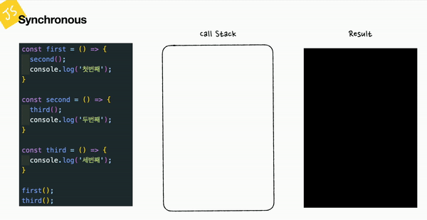
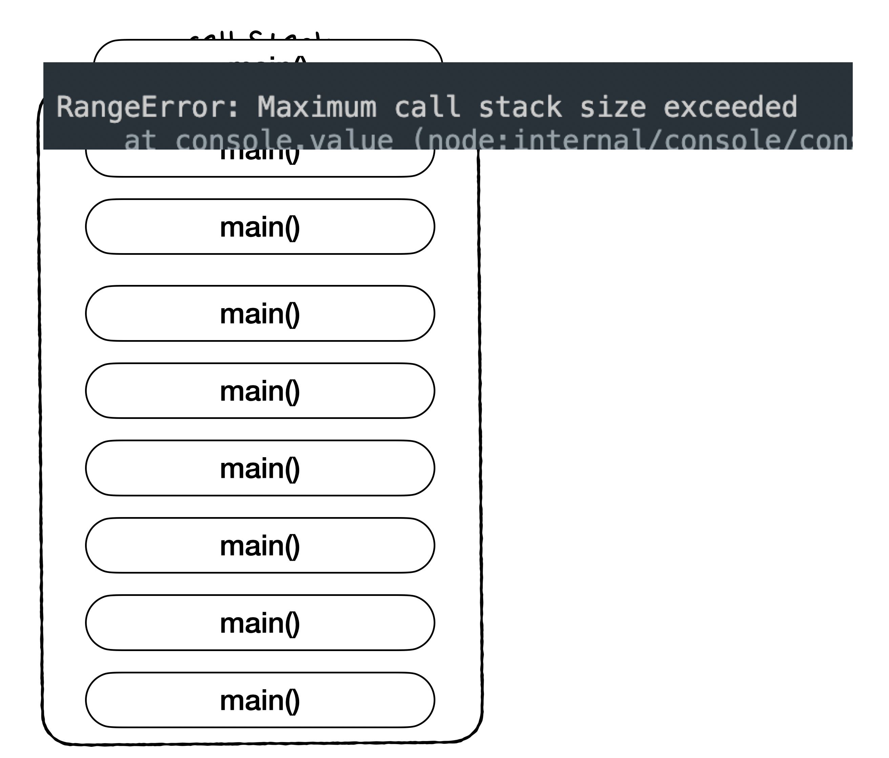
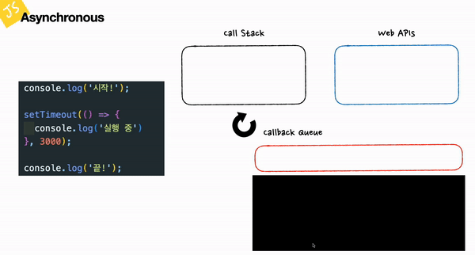
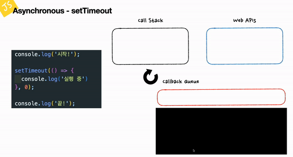
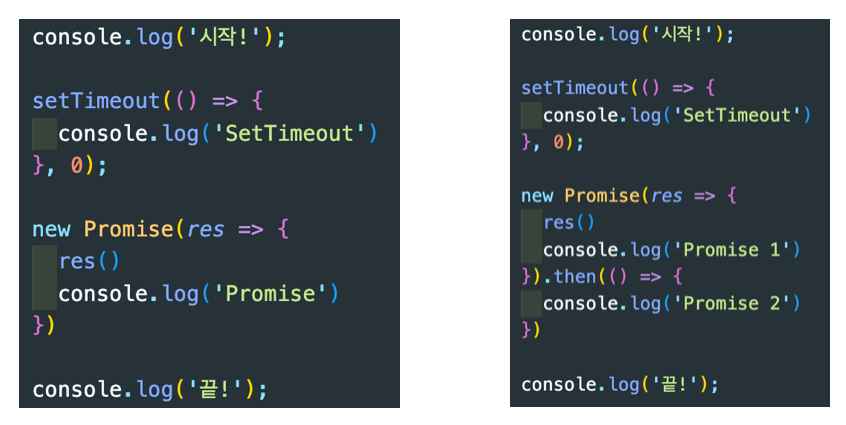
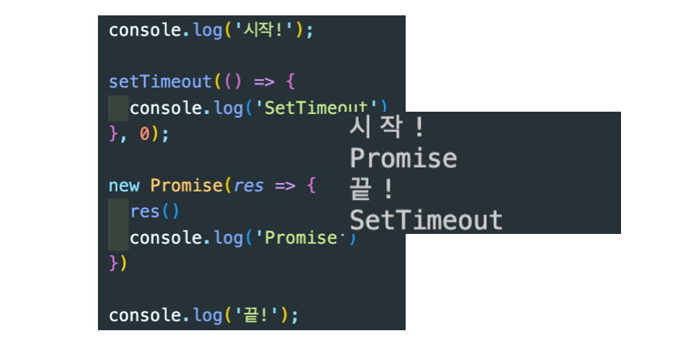
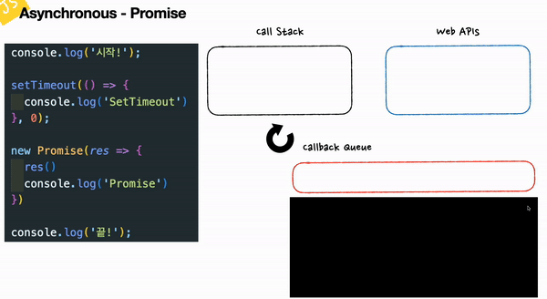
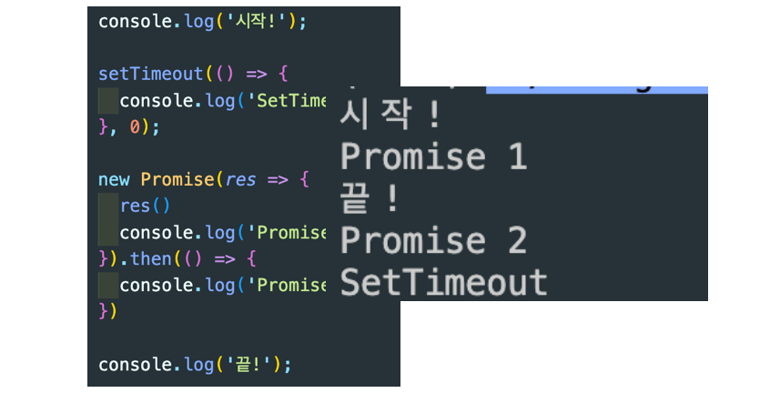
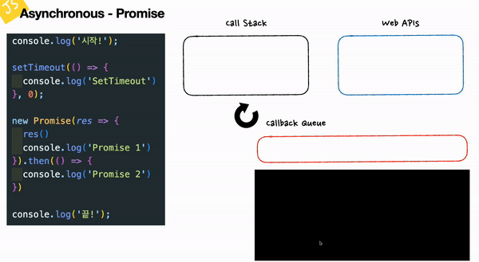
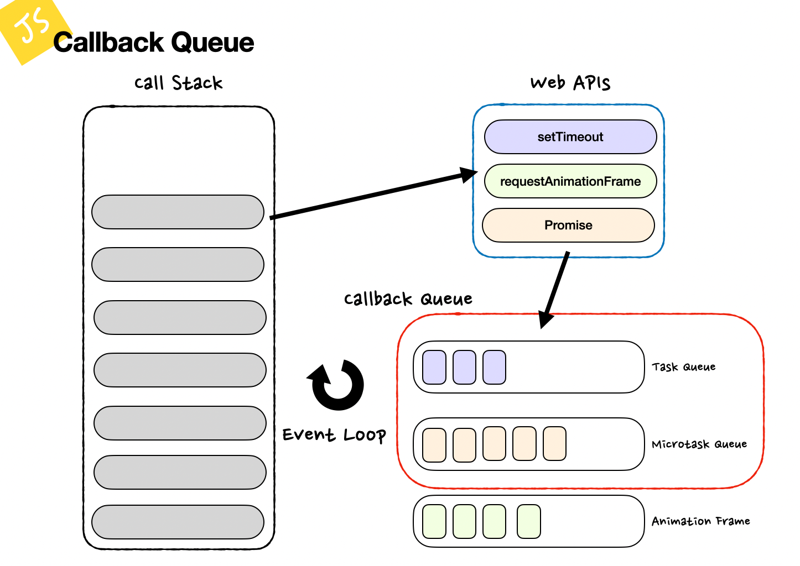

- [Notion에서 보기](https://www.notion.so/sangwoong-resume/JS-Event-Loop-b53fa0d072cc47e69ff8304e7a7ab7ba)(발표용 키노트가 포함되어 있습니다.)

> 🚀 우리는 개발자입니다. <br> 그 중에서도 JavaScript라는 언어를 사용하여 개발을 하고 있죠.<br> 허나 개발을 하면서 이런 말을 많이 한다고 합니다.<br> <br> A: 이게 왜 안되지?<br> B: 이게 왜 되지?…<br> A, B, C: 어? 금지!<br> <br> 우리는 이제 이런 `개발가스라이팅` 에서 벗어나 개발자의 본질을 찾아야 합니다. 우리는 프로니깐!<br> <br> 더 이상 내가 쓴 남이 쓴 코드가 왜 실행이 안되고 왜 실행이 잘 되는지 몰라서는 안됩니다.<br> <br> 다들 잘 알고 있겠지만, Javascript의 이벤트루프에 대해 이야기 해보고자 합니다.<br>

<br>
<br>

# 📍 1. 용어 정리

이벤트 루프에 대해 설명하고 예제를 알아보기 전에 용어부터 정리보겠습니다. 자바스크립트의 엔진 구조부터 살펴볼 것이니 같은 용어 개념을 확립 후 진행하겠습니다.

## 🔅 메모리 힙

메모리 할당이 이루어지는 곳입니다. 우리가 읽었던 코어 자바스크립트 1장부터 등장하는 개념인데요.

변수가 선언되고 할당되는 공간이 메모리 힙이라고 할 수 있습니다.

### ✔️ 힙 (Heap)

여기서 힙은 자료구조의 일종으로 구조화되지 않은 넓은 메모리 영역을 가리킵니다. 객체, 변수, 함수 등이 담기는 공간입니다.

## 🔅 콜 스택 (호출 스택)

콜스택은 실행될 코드가 한줄 단위로 할당되는 공간입니다. 이 실행 공간이 하나이기 때문에 자바스크립트는 싱글스레드 언어라고 표현을 하죠.

하지만 싱글스레드 언어가 병렬 처리를 할 수 있는 것처럼 보이는 비동기 처리도 지원하는데요. 이는 이벤트 루프 전체를 살펴보면서 차근차근 알아보겠습니다.

### ✔️ 스택 (Stack)

스택이라는 자료구조는 일상 생활 중 젠가를 떠올리면 될 것 같네요. 가장 먼저 들어간 나무 조각은 가장 나중에 꺼낼 수 있는 것처럼 스택에 담긴 데이터는 가장 나중에 쌓인 데이터가 가장 먼저 사용 되는 자료구조입니다.

## 🔅 Web APIs (Background)

비동기 처리를 담당하는 공간입니다. 브라우저에서는 Web APIs로 불리고 Node에서는 Background로 설명이 되곤합니다. `setTimeout()` 혹은 `Promise` 객체가 담기는 공간입니다.

## 🔅 콜백 큐

비동기 처리가 끝난 후 실행되어야 할 콜백 함수가 차례대로 할당되는 공간입니다.

콜백 큐는 태스크 큐, 이벤트 큐 등으로 이루어져 있는데 뒤 스텝에서 조금 더 자세하게 알아보도록 하겠습니다.

### ✔️ 1. 태스크 큐

### ✔️ 2. 마이크로 태스크 큐

### ✔️ 3. 이벤트 큐

### ✔️ 큐 (Queue)

큐라는 자료구조는 간단하게 말하면 놀이기구 줄 같은 녀석이죠. 먼저 줄 선 사람이 먼저 놀이기구를 탑니다. 큐도 마찬가지로 가장 먼저 담긴 데이터가 가장 먼저 사용되는 자료구조입니다.

## 🔅 이벤트 루프

우리가 이번 시간에 알아 볼 이벤트 루프는 사실 이 모든 과정이 아닙니다.

이벤트 루프는 자바스크립트가 코드를 실행하는 과정에 있어서 콜백 큐에 담긴 콜백 함수를 순서에 맞춰 콜 스택에 할당해주는 역할을 합니다.

<br>

# 📍 2. Synchronous

자바스크립트는 싱글스레드 언어라고 언급했습니다. 이 말은 코드를 처리하는 공간 (스택)이 하나라는 뜻입니다. 심지어 동기적인 코드를 실행할 때는 Web APIs나 Background 콜백 큐 등이 필요가 없개 되죠.

우선 동기적인 코드를 살펴보겠습니다. 아래 코드의 실행 결과가 어떻게 될까요?

```jsx
const first = () => {
  second();
  console.log("첫번째");
};

const second = () => {
  third();
  console.log("두번째");
};

const third = () => {
  console.log("세번째");
};

first();
third();
```

실행 결과는 다음과 같습니다:

```jsx
"세번째";
"두번째";
"첫번째";
"세번째";
```

위의 코드가 콜스택에서는 다음의 과정을 거쳐 코드를 실행시킵니다:



1. first() 함수의 실행 컨텍스트가 콜스택에 담깁니다.
2. second()함수의 실행 컨텍스트가 콜스택에 담깁니다.
3. third() 함수의 실행 컨텍스트가 콜스택에 담깁니다.
4. third() 함수 내부의 console.log(’세번째’)문이 실행됩니다.
5. second() 함수 내부의 console.log(’두번째’)문이 실행됩니다.
6. first() 함수 내부의 console.log(’첫번째’)문이 실행됩니다.
7. third() 함수의 실행 컨텍스트가 콜스택에 담깁니다.
8. third() 함수 내부의 console.log(’세번째’)문이 실행됩니다.

## 🔅 Maximum call stack size exceed

개발을 하면서 아래와 같은 에러를 많이 접할 수 있습니다.

```jsx
Uncaught RangeError: Maximum call stack size exceed
...
```

에러 문구를 보면 call stack의 사이즈 최대치를 초과했다는 것을 알 수 있습니다. 콜스택이 어떻게 동작하는지 이제는 잘 알기 때문에 이 에러를 만나면 무언가 콜스택에 자꾸 쌓이고 있구나라는 것을 짐작할 수 있습니다.

함수가 종료되어야 할 조건이 없는 재귀함수 혹은 반복문 등이 그 예가 될 수 있습니다.

```jsx
const main = () => {
  console.log("Main");
  return main();
};

main();
```

`main()` 함수를 다시 내부에서 호출하고 있네요. 그럼 아래와 같이 콜스택에는 main() 함수에 대한 컨텍스트가 넘치게 되고 특정 사이즈 이상으로 넘치면, 위와 같은 에러가 발생하게 됩니다.



참고로 콜스택의 사이즈는 일반적으로 10,000개라고 합니다. 크롬 브라우저의 경우 120,000개까지 스택을 쌓을 수 있다고 합니다.

<br>

# 📍 3. Asynchronous - setTimeout

### 🔅 setTimeout(() ⇒ {console .log(’’)}, 3000)

이번엔 비동기적으로 실행해야 될 코드가 있을 때 이벤트 루프가 어떻게 동작하는지 알아보겠습니다.

앞서 비동기 처리를 담당하는 공간은 `Web APIs (Background)` 라고 설명했습니다. 이번엔 콜스택 뿐만 아니라 `콜백 큐 (Callback Queue)` 도 코드 실행에 관여하게 됩니다.

우선 아래 코드를 실행하면 어떤 결과가 나올까요?

```jsx
console.log("사작!");

setTimeout(() => {
  console.log("실행 중");
}, 3000);

console.log("끝!");
```

결과는 아래와 같을 것입니다.

```jsx
시작!
끝!
실행 중
```

자바스크립트는 분명 싱글스레드 언어이면서 모든 코드가 한줄한줄 실행되기 때문에 아래와 같은 결과가 맞는 거 아니야? 라고 하실 수 있습니다.

```jsx
시작!
... 3초 후...
실행 중
끝!
```

하지만 자바스크립트는 그리 호락호락하지 않더군요.

만약 코드 실행 중간에 `setTimeout` 함수처럼 비동기적으로 실행할 수 있는 코드가 존재하는 경우 아래와 같이 코드를 실행하게 됩니다:



1. `console.log(’시작’)` 코드가 콜스택에 담긴 후 실행됩니다.
2. setTimeout() 함수가 콜스택에 담깁니다. 이 때 바로 실행되지 않고 `Web APIs` 로 이동합니다.
3. 비동기 처리를 진행하는 동안 `console.log(’끝’)` 코드가 콜스택에 담긴 후 실행됩니다.
4. Web APIs에서 처리된 setTimeout()의 콜백함수는 `콜백 큐 (Callback Queue)` 로 이동하게 됩니다.
5. 이벤트 루프 (Event Loop)는 콜백 큐에서 콜스택으로 전달할 콜백함수가 있는지 확인함과 동시에콜스택이 비어있는지를 확인합니다.
6. 3번 이후 콜스택에 더 이상 실행해야 될 코드가 쌓이지 않고 비어있기 때문에 콜백 큐에서 `console.log(’실행 중’)` 코드가 콜스택으로 이동하고 실행됩니다.

### 🔅 setTimeout(() ⇒ {console .log(’’)}, 0)

위에서는 3000ms를 기준으로 했기 때문에 분명 아니 그럼 0ms로 하면 바로 실행될 수 있는 거 아니야?라는 의구심을 품는 개발자도 있을텐데요.

코드를 한번 실행해볼까요?

```jsx
console.log("사작!");

setTimeout(() => {
  console.log("실행 중");
}, 0);

console.log("끝!");
```

놀랍게도 결과는 3000ms와 0ms로 설정했을 때 모두 동일합니다.

```jsx
시작!
끝!
실행 중
```

이벤트 루프가 동작하는 방식 역시 동일합니다. 설명 부분에서 제외했지만 사실 콜스택 첫번째 실행 컨텍스트로에는 `anonymous` 혹은 `main` 이 위치하게 됩니다. 따라서 아무리 빠르게 `setTimeout()` 함수가 종료되었다고 해도 콜스택이 완전히 비어있지 않기 때문에 이벤트 루프는 콜백 큐에서 콜스택으로 콜백 함수를 전달할 수 없는 것이죠.



1. `console.log(’시작’)` 코드가 콜스택에 담긴 후 실행됩니다.
2. setTimeout() 함수가 콜스택에 담깁니다. 이 때 바로 실행되지 않고 `Web APIs` 로 이동합니다.
3. 콜백 함수가 0ms 후에 실행되기 때문에 바로 실행되어 콜백 큐로 이동합니다.
4. `console.log(’끝’)` 코드가 콜스택에 담긴 후 실행됩니다.
5. `이벤트 루프 (Event Loop)`는 콜백 큐에서 콜스택으로 전달할 콜백함수가 있는지 확인함과 동시에콜스택이 비어있는지를 확인합니다.
6. 3번 이후 콜스택에 더 이상 실행해야 될 코드가 쌓이지 않고 비어있기 때문에 콜백 큐에서 `console.log(’실행 중’)` 코드가 콜스택으로 이동하고 실행됩니다.

<br>

# 📍 4. Asynchronous - Promise

자바스크립트의 비동기라는 키워드를 들었을 때 대다수 개발자들은 Promise를 떠올릴 것입니다. 하지만 Promise 자체는 사실 비동기가 아니라 동기입니다.

아래 두 코드를 보면, 같은 코드처럼 보일 수도 있습니다. 출력 결과를 보기 전에 왼쪽과 오른쪽의 코드가 어떻게 동작하는 지부터 한번 살펴보겠습니다.



## 🔅 Promise

많은 사람들이 Promise는 비동기다!라고 하지만 사실 동기적으로 실행되는 코드입니다. Promise가 비동기로 동작할 때는 `.then()` 을 만났을 때 뿐입니다. 왼쪽 코드를 보게 되면 Promise 코드에 `.then()` 함수가 연결되어 있지 않습니다. 이는 Promise 객체의 콜백 함수가 실행되더라도 비동기로 동작하지 않습니다.

따라서 결과를 아래 화면처럼 출력됩니다:



이 코드가 이벤트 루프에서 동작하는 방식은 다음과 같습니다:



1. console.log(’시작!’)이 콜스택에 쌓이고 실행됩니다.
2. setTimeout() 함수가 콜스택에 쌓이고 비동기이기 때문에 Web APIs에 콜백 함수가 이동합니다.
3. Promise()가 콜스택에 쌓이고 .then() 함수가 없기 때문에 바로 실행됩니다.
4. console.log(’끝!’)이 콜스택에 쌓이고 실행됩니다.
5. Web APIs에서 콜백 함수는 콜백 큐로 이동하고 이벤트 루프에 의해 콜스택으로 이동됩니다.
6. console.log(’SetTimeout’)이 실행됩니다.

## 🔅 Promise.then()

이번에는 Promise가 비동기로 동작하는 `.then()` 을 만났을 때의 결과와 이벤트 루프 동작 방식에 대해 알아보겠습니다. 오른쪽 코드는 Promise에 `.then()` 함수가 연결되어 있습니다.

이는 Promise 객체의 콜백 함수가 실행될 때 then() 함수 내부의 콜백 함수가 비동기적으로 실행될 것을 예측해볼 수 있는데요. 결과는 아래 화면과 같습니다:



`.then()` 함수 내부의 콜백 함수가 있을 때 출력 순서가 달라지는데요. 이벤트 루프에서는 다음과 같이 처리하기 때문입니다.



1. console.log(’시작!’)이 콜스택에 쌓이고 실행됩니다.
2. setTimeout() 함수가 콜스택에 쌓이고 비동기이기 때문에 Web APIs에 콜백 함수가 이동합니다.
3. Promise()가 콜스택에 쌓입니다. Promise의 콜백 함수는 동기적으로 실행되어 console.log(’Promise 1’)이 콜스택에서 바로 실행됩니다.
4. Promise().then()이 콜스택에 쌓입니다. 이 때 then() 함수를 만난 Promise는 비동기적으로 실행되어 Web APIs에 콜백 함수가 이동합니다.
5. console.log(’끝!’)이 콜스택에 쌓입니다. 이 때 해당 컨텍스트가 바로 실행되지 않고 콜스택에 쌓여있다고 가정하겠습니다.
6. Web APIs에서 setTimeout() 함수가 먼저 종료되어 콜백 큐로 이동합니다.
7. 이후 Web APIs에서 Promise().then()이 종료되어 콜백 큐로 이동합니다.
8. 이 때 콜백 큐에는 `setTimeout()`과 `Promise().then()` 가 대기하고 있습니다. 큐라는 특성 상 먼저 들어온 `setTimeout()` 이 실행될 것 같지만, Promise().then()이 먼저 콜스택으로 이동됩니다. 콜백 큐의 우선 순위 때문인데 이후에 조금 더 알아보겠습니다.
9. console.log(’끝’)이 실행되면서 anonymous 혹은 main 컨텍스트가 종료됩니다.
10. 콜스택이 비어있는지 이벤트 루프는 끊임없이 확인을 합니다.
11. 우선 순위에 따라 console.log(’Promise 2’)가 실행됩니다.
12. 마지막으로 console.log(’SetTimeout’)가 실행됩니다.

<br>

# 📍 5. Callback Queue

```jsx
Animation Frame은 콜백 큐에 포함되지 않고 이벤트 루프의 별도 단계에서 실행됩니다.
하지만 비동기를 다루는 이번 스텝에서 같이 살펴볼게요!
```

비동기 함수들이 이벤트 루프에서 처리되는 방식에 차이가 있다고 언급했습니다. 이는 콜백 큐에서 콜스택으로 이동할 때 비동기 함수의 우선 순위가 다르기 때문인데요.



우선 콜백 큐는 아래 두가지로 구성됩니다:

- Task Queue
- Microtask Queue

이벤트 루프에서 비동기를 처리하는 우선 순위는 다음과 같습니다:

```jsx
Microtask Queue > Animation Frame > Task Queue
```

그럼 각각에 대해 간단하게만 알아보겠습니다.

## 🔅 Microtask Queue

**마이크로태스크 큐**는 짧고 중요한 작업들을 처리하기 위해 사용됩니다. 일반적으로 비동기 작업의 결과를 처리하는 데 사용됩니다.

### 주요 특징

- **우선 처리**: 마이크로태스크는 태스크보다 먼저 처리됩니다. 이는 중요한 작업들이 빠르게 처리되도록 하기 위함입니다.
- **짧은 작업**: 마이크로태스크는 일반적으로 짧고 빠르게 완료될 수 있는 작업들로 구성됩니다.

### 포함되는 함수나 키워드

- `Promise.then()`
- `Promise.catch()`
- `Promise.finally()`

## 🔅 Animation Frame

**애니메이션 프레임**은 브라우저에서 애니메이션을 부드럽게 렌더링하기 위해 사용됩니다. 브라우저는 매 프레임마다 실행될 콜백 함수를 스케줄링합니다.

### 주요 특징

- **화면 리프레시와 동기화**: 브라우저의 리프레시 주기와 맞추어 실행되어 애니메이션이 부드럽게 보이도록 합니다.
- **고정된 주기**: 일반적으로 초당 60번(60fps) 호출됩니다.

### 포함되는 함수나 키워드

- `requestAnimationFrame()`
- `cancelAnimationFrame()`

## 🔅 Task Queue

**태스크 큐**는 주로 I/O 작업, 타이머, 이벤트 핸들러 등의 비동기 작업을 처리합니다. 마이크로태스크가 모두 처리된 후에 태스크 큐의 작업들이 실행됩니다.

### 주요 특징

- **비동기 작업 처리**: 네트워크 요청, 파일 읽기, 타이머와 같은 비동기 작업을 처리합니다.
- **이벤트 핸들링**: 클릭, 키 입력 등의 이벤트 핸들러가 태스크 큐에 추가됩니다.

### 포함되는 함수나 키워드

- `setTimeout()`
- `setInterval()`
- `setImmediate()` (Node.js)
- I/O 작업 콜백 (예: `fetch`, `XMLHttpRequest`)

<br>
<br>

---

### 참고자료

- MDN (https://developer.mozilla.org/ko/docs/Web/JavaScript/Event_loop)
- 모던 자바스크립트 https://ko.javascript.info/event-loop#ref-683
