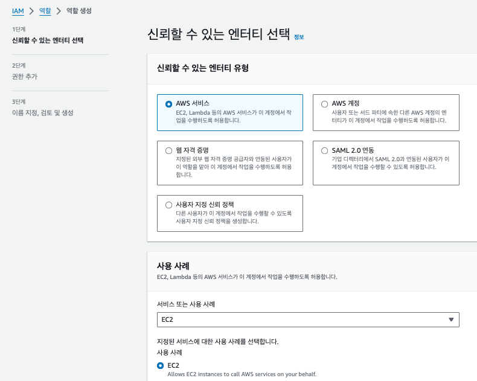
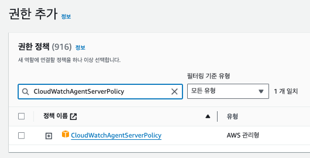
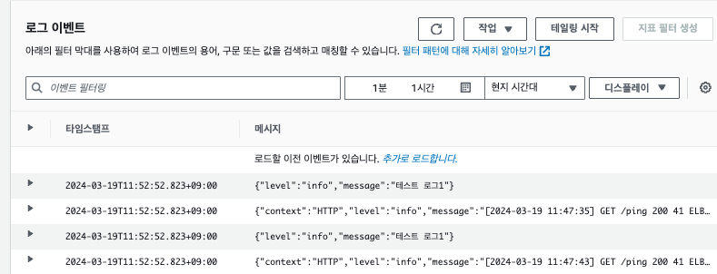

# [AWS] CloudWatch

# 📍 1. CloudWatch란?

AWS에서 제공하는 `CloudWatch (CloudWatch)`는 AWS 서비스를 모니터링 하거나 로그를 수집할 수 있는 서비스입니다. AWS 리소스 및 애플리케이션을 실시간으로 관찰하고 대시보드에서 시각적으로 표시할 수 있는 기능을 제공합니다. CloudWatch를 사용하면 AWS 환경의 성능을 추적하고 리소스 사용량을 모니터링하여 애플리케이션을 최적화하고 비용을 관리할 수 있습니다.

<br>

## 📍 2. CloudWatch의 기능

### 1. 메트릭 및 경보

CloudWatch는 AWS 리소스 및 애플리케이션에서 수집된 메트릭을 기반으로 사용자 지정 경보를 설정할 수 있습니다. 예를 들어, CPU 사용률이 특정 임계값을 초과하는 경우 경보를 트리거하여 작업을 시작할 수 있습니다.

### 2. 로그 모니터링

CloudWatch는 AWS 리소스의 로그 데이터를 수집하고 저장할 수 있습니다. Amazon CloudWatch Logs를 사용하여 로그 그룹을 생성하고 로그 데이터를 검색하고 분석하여 문제를 해결할 수 있습니다.

### 3. 대시보드

사용자 정의 대시보드를 생성하여 CloudWatch에서 수집된 메트릭 및 로그 데이터를 시각적으로 표시할 수 있습니다. 이를 통해 리소스 사용률과 애플리케이션 성능에 대한 통찰력을 얻을 수 있습니다.

### 4. 자동 조정

CloudWatch는 Auto Scaling 그룹 및 AWS 리소스에서 사용 가능한 CloudWatch 메트릭을 기반으로 자동 조정 작업을 트리거할 수 있습니다. 이를 통해 애플리케이션의 확장성을 향상시키고 자동으로 인프라 리소스를 조정할 수 있습니다.

### 5. 이벤트

CloudWatch 이벤트는 AWS 리소스에서 발생하는 이벤트 및 변경 사항을 감지하고 모니터링할 수 있습니다. 이러한 이벤트를 기반으로 자동화된 작업을 실행할 수 있습니다.

<br>

# 📍 3. CloudWatch 주요 장점

### 1. 통합 모니터링

CloudWatch는 다양한 AWS 서비스에서 수집된 메트릭 및 로그 데이터를 통합하여 단일 대시보드에서 모니터링할 수 있습니다. 이를 통해 종합적인 리소스 관리 및 성능 모니터링이 가능해집니다.

### 2. 실시간 모니터링

CloudWatch는 실시간으로 메트릭 데이터를 수집하고 대시보드에서 실시간으로 표시할 수 있습니다. 이를 통해 사용자는 리소스 상태를 신속하게 파악하고 문제를 빠르게 해결할 수 있습니다.

### 3. 확장성

CloudWatch는 AWS 환경에서 자동으로 확장되며 수백만 개의 메트릭을 처리하고 수천 개의 로그 그룹을 지원할 수 있습니다.

### 4. 비용 효율적

CloudWatch는 사용자가 필요한 만큼만 사용할 수 있으며, 사용량에 따라 비용이 청구됩니다. 따라서 비용을 절약하면서도 필요한 모니터링 요구 사항을 충족할 수 있습니다.

<br>

# 📍 4. EC2에 배포한 애플리케이션 로그 모니터링하기.

애플리케이션을 가장 빠르고 쉽게 배포할 수 있는 서비스로 AWS EC2를 많이 사용합니다. Node 기반의 프로젝트를 배포할 경우 PM2를 이용하여 로그를 모니터링 할 수 있지만, 매번 SSH 접속을 하여 모니터링을 하기엔 한계가 있으며, 로그 파일을 인스턴스에서 직접 관리해야 한다는 문제가 있습니다.

이를 해결하기 위해 모니터링 기능을 이용하기 위해 CloudWatch를 이용할 수 있습니다.

### 1) EC2 생성

우선 애플리케이션을 배포하기 위해 EC2 인스턴스를 생성합니다. 요즘 EC2 생성은 크게 어려운 부분이 없기 때문에 공식 문서 혹은 관련 블로그를 이용하면 쉽게 생성할 수 있습니다.

### 2) EC2 <> IAM Role

EC2 인스턴스에서 CloudWatch로 로그 스트림을 보내기 위해서는 IAM Role을 추가해주어야 합니다.

- 아래 화면과 같이 IAM Role을 생생해줍니다. 

- 다음 `CloudWatchAgentServerPolicy`를 선택합니다. 

### 3) EC2에 IAM Role 추가하기.

기존에 사용 중인 EC2가 있다면 IAM Role만 추가해주면 되고, 새로 생성하는 경우 IAM Role에 2번 단계에서 만든 정책을 추가하여 생성합니다.

### 4) EC2 인스턴스 CloudWatch Agent 생성하기

이제 CloudWatch로 로그를 보내기 전에 에이전트를 설치합니다. EC2 인스턴스 OS에 맞는 설치 방법은 [공식 문서](https://docs.aws.amazon.com/AmazonCloudWatch/latest/monitoring/download-cloudwatch-agent-commandline.html)에서 확인할 수 있습니다.

- Ubuntu OS 기준 설치 CLI는 다음과 같습니다:

```SHELL
$ wget https://s3.amazonaws.com/amazoncloudwatch-agent/ubuntu/amd64/latest/amazon-cloudwatch-agent.deb
```

- 이후 패키지를 설치해줍니다. 다운로드가 완료되면 다음 명령을 사용하여 클라우드와치 에이전트를 설치합니다.

```SHELL
$ sudo dpkg -i amazon-cloudwatch-agent.deb
```

- 클라우드와치 에이전트의 구성 파일을 생성하고 편집합니다.

```SHELL
$ sudo vim /opt/aws/amazon-cloudwatch-agent/etc/amazon-cloudwatch-agent.json
```

- 에디터 모드에 진입하면 로그와 매트릭스에 대한 설정을 작성할 수 있습니다.
  - `file_path`: 로그를 스트리밍 할 디렉토리를 설정합니다.
  - `log_group_name`: CloudWatch에서 사용되는 로그 그룹 이름을 설정/지정합니다. 생성된 로그 그룹이 없다면 설정 파일을 적용할 때 자동으로 생성됩니다.
  - `log_stream_name`: 로그 스트림 이름을 지정합니다.

```JSON
{
  "logs": {
    "logs_collected": {
      "files": {
        "collect_list": [
          {
            "file_path": "/path/to/your/nest/application-*.log", // "/home/ubuntu/logs/info/*.info.log"
            "log_group_name": "YourLogGroupName", //  "ec2)project-name-logs"
            "log_stream_name": "{instance_id}-nest-application.log"
          }
        ]
      }
    }
  }
}
```

- 에이전트 시작

```SHELL
$ sudo /opt/aws/amazon-cloudwatch-agent/bin/amazon-cloudwatch-agent-ctl -a fetch-config -m ec2 -c file:/opt/aws/amazon-cloudwatch-agent/etc/amazon-cloudwatch-agent.json -s
```

### 5) 로그 확인하기

설정과 에이전트를 시작했다면 프로젝트의 로그를 CloudWatch > 로그 그룹 > 로그 스트림에서 확인할 수 있습니다: 
