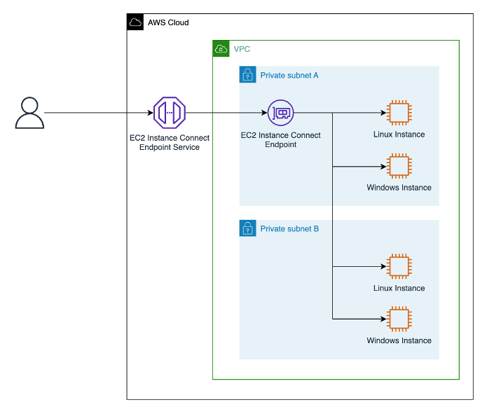
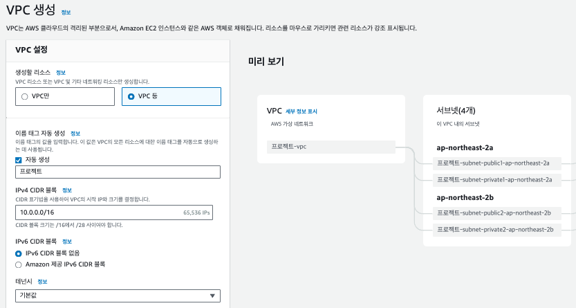
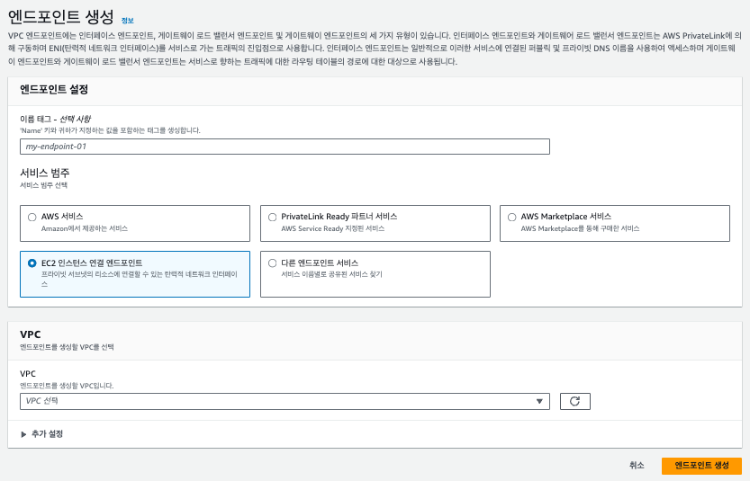

# 📍 1. EC2 Instance Connect Endpoint

보안을 고려하여 Private Subnet에 EC2 인스턴스를 배포하면 Public IP주소를 할당 받을 수 없습니다. 이런 인스턴스에 SSH 혹은 RDP로 접속할 수 있는 서비스가 바로 `EC2 Instance Connect Endpoint`입니다.

핵심 특징은 다음과 같습니다:

- 인스턴스에 직접 연결할 수 있습니다.
- SSH 키를 직접 관리하지 않아도 되기 때문에 관리가 용이해집니다.
- IAM Role을 통해 보안을 강화할 수 있습니다.

 

# 📍 2. 연결 과정

AWS 공식문서에서는 해당 Endpoint로 Private Subnet에 접속할 수 있는 과정을 다음 다이어그램으로 설명하고 있습니다. 

- 우선 EC2 Instance Connect Endpoint를 특정 VPC의 Subnet에 프로비저닝 합니다.
- 생성한 Endpoint를 활용해 해당 Subnet과 연동된 VPC안의 모든 Subnet에 접속할 수 있게 됩니다.
- Endpoint에는 보안그룹을 설정할 수 있습니다. SSH 접속을 위해 인바운드 트래픽을 허용하는 적정 보안그룹을 설정합니다.

 

# 📍 3. SSM Session Manager와 차이점은?

1. 구현 방식

- 엔드포인트 생성 개수 (EIC:SSM = 1:3)

2. 로그

- EIC Endpoint는 CloudTrail을 활용한 로깅만 가능합니다.
- SSM Session Manager는 CloudTrail, CloudWatch를 활용하여 S3와도 연동할 수 있습니다.

3. 보안 제어

- EIC는 IAM과 Security Group을 활용할 수 있습니다.
- Session Manager는 IAM으로 보안 제어를 관리합니다.

4. 비용

- EIC는 `무료`입니다.
- Session Manager는 생성된 3개의 엔드포인트에 대해 비용이 발생합니다.

5. 고가용성

- EIC는 VPC 1개에 대해 1개만 생성할 수 있기 때문에 가용성에 대한 고민이 필요합니다.
- Session Manager는 기본적으로 고가용성이 내제되어 있습니다.

 

# 📍 4. EIC 생성 및 접속하기

EC2 Instance Connect Endpoint는 생각보다 쉽게 생성하고 접속할 수 있습니다.

### ✔️ 1) VPC를 생성합니다.

- 서비스 검색에서 VPC를 생성합니다.
- VPC 생성 후 서브넷을 생성하고 라우팅 테이블을 설정해주어야 합니다. `VPC 등`을 선택하면 모든 작업을 자동화 할 수 있습니다.  

### ✔️ 2) EC2 인스턴스를 생성합니다.

- EC2 `인스턴스 시작하기`를 통해 Private Subnet에 인스턴스를 생성합니다.

### ✔️ 3) VPC 엔드포인트를 생성합니다.

- VPC 서비스로 이동하여 엔드포인트로 이동합니다.
- `EIC Endpoint`를 선택합니다.
- 1번에서 생성한 VPC를 선택하고 Subnet을 선택합니다.  

### ✔️ 4) 보안그룹을 적절하게 수정합니다.

- EIC와 EC2의 보안그룹을 동일하게 설정할 수도 있습니다. 필요 시 일부 트래픽을 제한하기 위해 적절하게 보안 그룹을 수정합니다.

### ✔️ 5) EC2 인스턴스에서 EIC 접속하기

생성된 EIC 엔드포인트와 동일한 VPC 중 Private Subnet에 배포된 EC2 인스턴스 콘솔로 이동합니다. 인스턴스 페이지 상단에 `연결`을 클릭하면 아래와 같은 화면을 볼 수 있습니다. 

- EC2 인스턴스 연결 탭을 선택합니다.
- `EC2 인스턴스 연결 엔드포인트를 사용하여 연결`을 선택합니다.
- `EC2 인스턴스 연결 엔드포인트`를 선택합니다.
- Username을 입력합니다. 각 OS에 맞는 username을 입력합니다.
- 최대 터널 연결 기간을 선택합니다.

 

## 공식문서

- [AWS EIC Tech Blog](https://aws.amazon.com/ko/blogs/tech/ec2-instance-connect-endpoint-bastion/)
