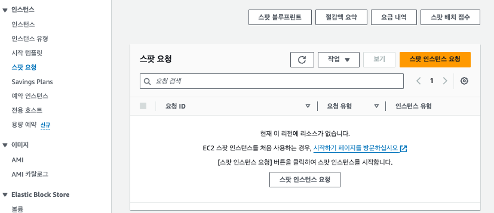

# 📍 1. Amazon EC2

EC2는 Amazon Elastic Compute Cloud의 약자로, AWS(Amazon Web Services)에서는 기본적으로 EC2라는 서비스를 통해서 확장 가능한 compute를 사용자에게 제공해 줍니다.

AWS의 가장 대표적인 IaaS(Infrastructure as a Service)인 EC2를 통해서 사용자는 본인에게 필요한 사양을 쉽게 고르고 가상 서버를 지칭하는EC2 인스턴스를 생성해서 원하는 시간만큼 사용할 수 있습니다. 간단히 말해 AWS에게 컴퓨터를 대여하는 것입니다.

Amazon EC2는 운영 서버에 필요한 대부분의 OS(Ubuntu, CentOS, Window 등)를 지원하고, 사용 목적에 맞는 수십 가지 사양들(CPU, Memory, Storage)을 제공합니다.

EC2는 사용량별 과금 모델을 따르기 때문에, 인스턴스 타입에 따라 시간 단위 또는 초 단위로 실제 사용한 만큼만 지불하면 됩니다. 따라서 새로운 서버를 구축하기 위해서 초기에 직접 서버를 구매하고 관리를 위한 공간과 인터넷망을 구축하고 전기요금, 네트워크 비용등 관리비를 지급하던 기존의 방식에 비하면 클릭 몇번을 통해 정말 간편하고 저렴하게 서버를 이용할 수 있습니다.

또한 EC2 서비스는 확장성을 고려해서 만들어졌습니다. 특정 서버(EC2 인스턴스)에 트래픽이 집중되면 거의 즉각적으로 새로운 서버를 추가할 수 있고, 트래픽이 감소하면 추가했던 서버를 즉시 제거할 수 있습니다.

예를 들어, 회사의 한 주 워크로드를 처리하는데 12개의 CPU를 탑재한 서버가 필요한 상황일 때, 주말에 트래픽이 두 배로 늘어날 것으로 예상될 경우 주말 동안 12개의 CPU를 탑재한 서버를 하나 더 추가해서 사용하고, 월요일에 출근해서 새롭게 추가했던 서버를 삭제할 수 있습니다. 회사에서 이 과정에서 지불하게 되는 비용은 토요일과 일요일 사이 새롭게 추가된 서버에 대한 비용일 뿐입니다.

이렇게 Amazon EC2 서비스를 이용하면 하드웨어에 투자하지 않고도 On-demand로 원하는 사양의 가상화된 서버를 신속하게 만들고 사용할 수 있습니다.

<br>

# 📍 2. EC2 장점

EC2를 사용하면 On-demand로 원하는 시간에 원하는 사양의 가상 서버를 빠르게 만들어서 매우 유연하게 사용할 수 있습니다. 뿐만 아니라 아래와 같은 다른 장점들도 존재합니다:

### ✔️ 확장성과 탄력성

- 자동으로 EC2 인스턴스의 수를 조절할 수 있는 `Auto Scaling` 기술을 접목할 수 있습니다.
- 서버를 자등올 `Scale-up` 또는 `Scale-down` 할 수 있습니다.
- 필요한 만큼의 자원만 프로비저닝 후 추가 수요가 발생하거나 트래픽 증가를 대비하여 Auto Scaling을 통해 신속하게 서버를 확장할 수 있습니다.

### ✔️ 보안성

- 가상 방화벽의 기능을 수행하는 `Securiy Group (SG)`을 이용하여 트래픽을 허용하거나 차단하고 네트워크 보안 수준을 높일 수 있습니다.

### ✔️ 다양한 AWS 서비스와의 통합

- AWS 내의 VPC, RDS, ELB 등 다양한 서비스와 연동할 수 있습니다.
- 각 기업의 니즈에 맞는 운영 서버를 구축하고, 광범위한 애플리케이션 간 클라우드 스토리지에 대해 완전하고 안전한 솔루션을 제공할 수 있습니다.

<br>

# 📍 3. EC2 인스턴스 유형

AWS EC2는 사용자의 요구에 맞게 서버를 만들 수 있도록 아주 다양한 선택지를 제공해 주어 이 덕분에 비용에 대한 최적화도 쉽게 할 수 있습니다. EC2 인스턴스를 생성할 때는 OS와 Security Group외에도 다양한 인스턴스 유형을 지정할 수 있습니다.

EC2 인스턴스는 특정 유형의 작업에 최적화된 패밀리로 그룹화 되어있으며, 각 패밀리 별 지정된 공식적인 용어가 있습니다.

아래와 같이 특정 유형의 작업에 따라 패밀리로 그룹화 된 인스턴스 타입은 CPU, 메모리, 스토리지 및 네트워킹 용량의 다양한 조합으로 구성되며, 애플리케이션에 따라 적합한 리소스 조합을 선택할 수 있는 유연성을 제공합니다.

## 🔸 온디맨스 (On-demand) 인스턴스

온디맨스 인스턴스는 말 그대로 사용한 만큼 리소스를 프로비저닝하고 비용을 지불하는 인스턴스 유형입니다. 온드맨드 인스턴스를 사용하기 적합한 상황은 다음과 같습니다:

- 저렴하고 유연한 인스턴스를 사용하고 싶은 경우
- 인스턴스의 워크로드를 예측할 수 없는 경우

유연한 확장과 비용을 경제적으로 관리할 수 있는 온디맨드 인스턴스의 유형은 다음과 같습니다:

### ✔️ 범용 인스턴스

- `T` 시리즈 (예: t3, t4g) 및 A 시리즈 (예: a1)와 같은 인스턴스 패밀리를 사용하여 범용 인스턴스를 나타냅니다.
- 균형있는 컴퓨팅, 메모리 및 네트워킹 리소스를 제공하며, 다양한 워크 로드에 사용할 수 있습니다.
- 웹 서버 및 코드 레포지토리 같이 균등한 비율로 리소스를 사용하는 애플리케이션에 적합합니다.

### ✔️ 컴퓨팅 최적화 인스턴스

- `C` 시리즈 (예: c6g, c5)와 같은 인스턴스 패밀리가 컴퓨팅 최적화 인스턴스를 나타냅니다.
- 고성능 프로세서를 활용하는 컴퓨팅 집약적인 애플리케이션에 적합합니다.

### ✔️ 메모리 최적화 인스턴스

- `R` 시리즈 (예: r6g, r5)와 X 시리즈 (예: x1e) 등이 메모리 최적화 인스턴스를 나타냅니다.
- 메모리에서 대규모 데이터를 처리하는 워크로드를 위한 빠른 성능을 제공하기 위해 설계된 인스턴스입니다.

### ✔️ 스토리지 최적화 인스턴스

- `I` 시리즈 (예: i3, i3en)와 D 시리즈 (예: d3) 등이 스토리지 최적화 인스턴스를 나타냅니다.
- 로컬 스토리지의 대규모 데이터에 대하여 많은 읽기 및 쓰기를 요구하는 워크로드를 위해 설계된 인스턴스 입니다.

### ✔️ 가속화된 컴퓨팅 인스턴스

- `P` 시리즈 (예: p4) 및 F 시리즈 (예: f1)와 같은 GPU를 사용하는 인스턴스가 가속화된 컴퓨팅 인스턴스를 나타냅니다.
- GPU를 기반으로 하여 그래픽 처리, 데이터 패턴 일치 등의 기능을 CPU에서 실행되는 소프트웨어보다 훨씬 더 효율적으로 수행하는 인스턴스입니다.

## 🔸 스팟 (Spot) 인스턴스

스팟 인스턴스는 일종의 경매 방식의 인스턴스입니다. 온디맨스 인스턴스와 같이 직접 인스턴스의 세부 옵션을 설정하여 프로비저닝 하는 방식이 아니라, 사용 가능한 인스턴스를 잠시 빌려 사용하는 방식입니다.

따라서 스팟 인스턴스 아래와 같은 특징을 지닙니다:

- 사용 가능한 여유 자원에 따라 가격이 변동할 수 있습니다.
- 언제든지 중지될 수 있거나 가격이 변동될 수 있습니다.

이러한 특징이 있는 스팟 인스턴스는 개발 환경 혹은 애플리케이션을 테스트 할 때 이용하면 비용을 절감할 수 있는 좋은 옵션이 될 수 있습니다.

아래 화면과 같이 `스팟 요청` 페이지에서 스팟 인스턴스를 요청할 수 있습니다.  <br>

# 📍 4. EC2 인스턴스 생성 방법

EC2 인스턴스를 생성하는 방법에는 다양한 방법이 있습니다. AWS 홈페이지에 로그인을 하여 콘솔에서 직접 생성을 할 수도 있고, 이미 만들어진 템플릿을 이용하여 인스턴스를 생성할 수 있습니다.

### ✔️ 콘솔에서 EC2 인스턴스 생성하기.

콘솔에서 직접 EC2 인스턴스를 필요한 리소스만큼 선택하여 프로비저닝 할 수 있습니다. 새로운 인스턴스와 더불어 Amazon Machine Image (AMI)를 활용하여 기존에 생성되어 있는 인스턴스를 그대로 생성할 수 있습니다.

1. AWS 콘솔에 root 계정 혹은 IAM 계정으로 로그인을 해줍니다.
2. EC2 대시보드로 이동하여 `인스턴스 시작`을 클릭합니다.
3. AMI 선택, OS 선택, 유형 선택 등 각자 필요한 리소스 유형에 맞는 옵션을 선택하여 인스턴스를 생성합니다.

### ✔️ CLI를 활용하여 EC2 인스턴스 생성하기.

AWS CLI를 이용하여 인스턴스를 생성할 수 있습니다. CLI로 생성할 때 주의해야 할 점은 `aws configure` 명령어를 사용하여 AWS 계정과 관련된 정보를 미리 구성해두어야 합니다.

1. Configuration 구성

계정 정보를 구성합니다.

```powershell
$ aws configure
```

2. 인스턴스 생성

계정 정보를 구성했다면 아래 명령어를 통해 인스턴스를 생성합니다. 원하는 AMI ID, 인스턴스 유형, 키페어 이름, 서브넷 ID 등을 명령어에 맞게 지정하여 실행할 수 있습니다.

```powershell
$ aws ec2 run-instances --image-id ami-xxxxxxxx --instance-type t2.micro --key-name YourKeyPairName --subnet-id subnet-xxxxxxxx
```

### ✔️ CloudFormation으로 EC2 인스턴스 생성

CloudFormation은 AWS 서비스와 통합되어 있어 인프라스트럭처를 코드로 정의하고 프로비저닝하며 자동으로 애플리케이션을 배포할 수 있는 서비스입니다. 인프라스트럭처가 이미 구성되어 있는 경우 CloudFormation을 활용하면 AWS 리소스를 더 간편하게 관리할 수 있습니다.

만약 CloudFormation이 없다면 아래 단계를 통해 EC2 인스턴스를 생성하는 포맷을 만들 수 있습니다.

1. CloudFormation 스택 생성

AWS의 CloudFormation 서비스로 이동하여 스택을 생성합니다.

2. 템플릿 업로드 또는 작성기존 템플릿을 사용하거나, 직접 템플릿을 작성합니다. EC2 인스턴스, 네트워킹 구성, 보안 설정 등이 포함된 템플릿을 생성합니다.

3. 스택 배포스택을 생성한 후 `스택 작업` 메뉴에서 `스택 생성`을 선택하여 템플릿을 배포합니다.

<br>

## 공식문서

- [Amazon EC2](https://aws.amazon.com/ko/pm/ec2/?gclid=CjwKCAiAiP2tBhBXEiwACslfntx4pW1JWimnawMTk0Y-MbCdpThvN2cRNmiM18KeiN4i8dEYzqjUnxoC5GcQAvD_BwE&trk=4c74fd91-5632-4f18-ac76-a6c66c92e185&sc_channel=ps&ef_id=CjwKCAiAiP2tBhBXEiwACslfntx4pW1JWimnawMTk0Y-MbCdpThvN2cRNmiM18KeiN4i8dEYzqjUnxoC5GcQAvD_BwE:G:s&s_kwcid=AL!4422!3!477203497843!e!!g!!amazon%20ec2!11549843702!111422708806)

- [Amazon EC2 Pricing](https://aws.amazon.com/ko/ec2/pricing/?gclid=CjwKCAiAiP2tBhBXEiwACslfnuyqtqNkWLgjynrXpX7eBhn95-TCHN9yRx6cNcQzc7bGA6tGHptl_hoCTOQQAvD_BwE&trk=4c74fd91-5632-4f18-ac76-a6c66c92e185&sc_channel=ps&ef_id=CjwKCAiAiP2tBhBXEiwACslfnuyqtqNkWLgjynrXpX7eBhn95-TCHN9yRx6cNcQzc7bGA6tGHptl_hoCTOQQAvD_BwE:G:s&s_kwcid=AL!4422!3!477203497843!e!!g!!amazon%20ec2!11549843702!111422708806)

- [Amazon EC2 On-demand Instance Pricing](https://aws.amazon.com/ko/ec2/pricing/on-demand/)
- [Amazon EC2 Spot Instance Pricing](https://aws.amazon.com/ko/ec2/spot/pricing/)
