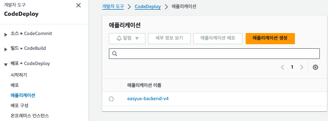
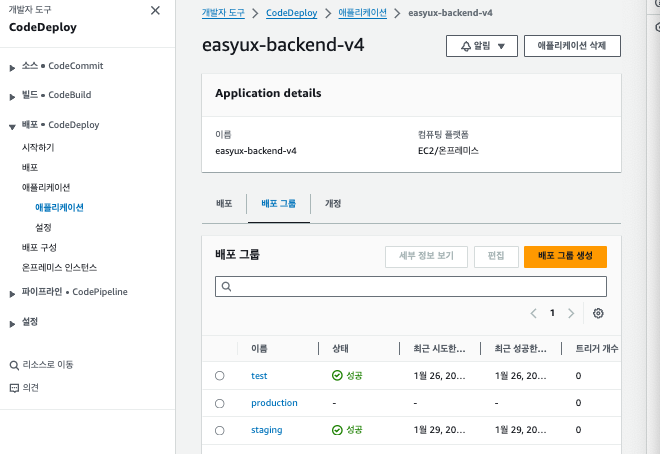
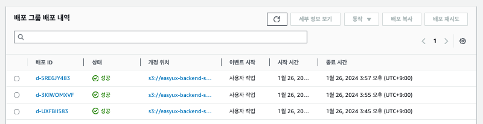

# [AWS] CodeDeploy

# 📍 1. CodeDeploy란?

CodeDeploy는 Amazon EC2 인스턴스, 온프레미스 인스턴스, 서버리스 Lambda 함수 또는 Amazon ECS 서비스로 애플리케이션 배포를 자동화하는 배포 서비스입니다.

AWS 공식문서에서는 아래 항목들을 포함하여 다양한 애플리케이션 콘텐츠를 거의 무제한으로 배포할 수 있다고 합니다:

- 코드
- 서버리스 AWS Lambda 함수
- 웹 및 구성 파일
- Executables
- 패키지
- 스크립트
- 멀티미디어 파일

CodeDeploy는 서버에서 실행되고 Amazon S3 버킷, GitHub 리포지토리 또는 Bitbucket 리포지토리에 저장되는 애플리케이션 콘텐츠를 배포할 수 있습니다. 또한 CodeDeploy는 서버리스 Lambda 함수를 배포할 수 있습니다. CodeDeploy를 사용하기 위해 기존 코드를 변경할 필요가 없습니다.

<br>

# 📍 2. CodeDeploy 이점

CodeDeploy는 다음 이점을 제공합니다:

- **다양한 서비스와의 통합**
  - CodeDeploy를 사용하면 서버 상의 기존 애플리케이션과 서버리스 AWS Lambda 함수 버전 또는 Amazon ECS 애플리케이션을 배포하는 애플리케이션을 모두 배포할 수 있습니다.
- **배포 자동화**
  - CodeDeploy는 개발, 테스트 및 프로덕션 환경에 걸쳐 애플리케이션 배포를 완전 자동화합니다. 그리고 CodeDeploy는 인프라에 맞춰 규모를 조정할 수 있으므로 인스턴스 하나 또는 수천 개에 배포할 수 있습니다.
- **가동 중지 최소화**
  - 애플리케이션이 EC2/온프레미스 컴퓨팅 플랫폼을 사용하는 경우 CodeDeploy는 애플리케이션 가용성을 극대화합니다. 인 플레이스(In-place) 배포에서 CodeDeploy는 Amazon EC2 인스턴스 전체에 대해 롤링 업데이트를 수행합니다. 업데이트 시 오프라인 상태가 될 수 있는 인스턴스 수를 지정할 수 있습니다. 블루/그린 배포 시에는 최신 애플리케이션 수정이 대체 인스턴스에 설치됩니다. 선택한 경우 새로운 환경 테스트를 완료한 직후 이러한 인스턴스로 트래픽이 다시 라우팅됩니다. 두 가지 배포 유형에 대해 CodeDeploy는 사용자가 구성한 규칙에 따라 애플리케이션 상태를 추적합니다.
- **중지 및 롤백**
  - 오류가 있는 경우 자동 또는 수동으로 배포를 중지하고 롤백할 수 있습니다.
- **중앙 집중식 제어**
  - CodeDeploy 콘솔 또는 AWS CLI를 통해 배포 상태를 시작 및 추적할 수 있습니다. 각 애플리케이션 개정이 배포된 시점 및 Amazon EC2 인스턴스가 나열된 보고서가 제공됩니다.
- **채택 편의성**
  - CodeDeploy는 플랫폼과 관련된 제약이 없으므로 모든 애플리케이션과 작동합니다. 사용자는 설정 코드를 쉽게 재사용할 수 있습니다. 또한 CodeDeploy는 소프트웨어 릴리스 프로세스 또는 지속적 전달 도구 체인과 통합이 가능합니다.
- **동시 배포**
  - EC2/온프레미스 컴퓨팅 플랫폼을 사용하는 1개 이상의 애플리케이션이 있는 경우에는 CodeDeploy를 통해 동일한 인스턴스 세트에 동시에 배포할 수 있습니다.

<br>

# 📍 3. CodeDeploy 생성하기

배포 그룹은 AWS CodeDeploy에서 배포를 관리하는 논리적인 그룹입니다. 배포 그룹에는 배포되는 대상(인스턴스, Lambda 함수, ECS 서비스 등) 및 배포를 어떻게 수행할지에 대한 설정이 포함됩니다. 배포 동작은 이러한 배포 그룹에서 정의된 전략 및 구성에 따라 이루어집니다.

### ✔️ CodeDeploy 생성하기

1. 배포 프로세스 대상이 되는 `애플리케이션`을 생성합니다.

   

2. 생성된 애플리케이션을 선택하여 `배포 그룹`을 생성합니다.

   

   `배포 그룹 생성` 버튼을 클릭하면 중간에 서비스 역할을 선택하는 탭이 있습니다. 여기서는 CodeDeploy와 연결할 서비스에 대해 IAM 역할을 생성하여 추가해주면 됩니다. e.g., 만약 S3 객체로 저장되는 파일을 가져와 EC2 인스턴스에 배포를 하려고 한다면 다음 두가지 액세스 정책이 추가된 역할을 생성하고 연결해줍니다.

   - AmazonS3FullAccess
   - AmazonEC2FullAccess

3. 배포 그룹을 생성할 때 필요한 기본 옵션은 다음과 같습니다.
   - `배포 그룹 이름`: 배포 그룹 이름을 설정해주면 됩니다.
   - `서비스 역할`: 2번에서 생성한 IAM 역할 선택
   - `배포 유형`
   - `환경 구성`: EC2 인스턴스를 선택할 경우 배포 대상이 되는 EC2 인스턴스를 선택합니다.
   - 배포 설정

### ✔️ EC2 인스턴스 Code Deploy Agent 설치하기

배포 그룹을 생성할 때 환경 구성 순서에서 EC2 인스턴스를 선택하는 경우 EC2 내부에 CodeDeploy 에이전트가 설치되어 있어야 합니다. EC2 인스턴스에 CodeDeploy Agent를 설치하는 순서에 대해 간단하게 알아보겠습니다.

해당 문서에서는 Ubuntu를 기준으로 작성하였고, 공식문서에는 Linux와 Windows에서 설치하는 방법도 잘 제공되고 있습니다.

1. CodeDeploy를 설치 할 EC2 인스턴스에 접속합니다.
2. 아래 명령어를 차례대로 입력해줍니다.

```powershell
$ sudo apt update
$ sudo apt install ruby-full
$ sudo apt install wget
```

1. home 디렉토리로 이동합니다.

```powershell
$ cd /home/ubuntu
```

1. 다음 명령어를 입력합니다.

```powershell
$ wget https://aws-codedeploy-us-east-2.s3.us-east-2.amazonaws.com/latest/install
```

1. 다음 명령어를 입력합니다.

```powershell
$ chmod +x ./install
$ sudo ./install auto
```

1. codeDeploy Agent 실행 여부 확인하기.

```powershell
$ sudo service codedeploy-agent status
```

<br>

# 📍 4. CodeDeploy 동작 프로세스 알아보기

CodeDeploy는 배포 대상 서비스에 따라 동작하는 프로세스에 차이가 있습니다. 이번 문서에서는 EC2 인스턴스를 배포 대상으로 설정했을 때의 프로세스에 대해 알아보겠습니다.

1. 애플리케이션 및 배포 그룹을 생성합니다. 만약 이미 생성된 애플리케이션이나 배포 그룹이 있다면, 지정된 애플리케이션 - 배포 그룹을 사용하게 됩니다.
2. S3에 배포 리소스 파일을 업로드 합니다. EC2 인스턴스에 코드를 배포할 때 CodeDeploy의 아키텍는 S3 버킷에서 파일을 가져와 배포를 하도록 설계되어 있습니다.
3. 배포 구성 및 배포 시작배포 그룹에 지정된 구성 옵션을 기준으로 배포가 시작됩니다. CodeDeploy는 애플리케이션 루트 디렉토리에 지정된 `appspec.yml` 파일을 참고하여 S3 버킷의 객체로 업로드 된 애플리케이션 코드와 파일을 EC2 인스턴스로 복사합니다.
4. 배포 그룹의 배포 내역을 확인할 수 있습니다. 배포가 실패한 경우 실패한 시점의 이벤트 로그를 확인할 수도 있습니다.

   

<br>

# 📍 5. Code Repository 연동하기

CodeDeploy 역시 코드 저장소와 연동하여 배포 프로세스를 자동화 할 수 있습니다.

### ✔️ appspec.yml

우선 CodeDeploy 프로세스를 동작시키기 위해 프로젝트 루트 디렉토리에 위치해있는 `appspec.yml` 파일에 대해 알아보겠습니다:

- CodeDeploy에서 배포를 관리하는 데 사용하는 YAML 형식 또는 JSON 형식의 파일입니다.
- 파일에 정의된 일련의 수명 주기 이벤트 후크로 애플리케이션 배포를 관리하는 데 사용됩니다.

실제 프로젝트 코드에 빗대어 살펴보겠습니다.

```yaml
version: 0.0
os: linux
files:
  - source: /
    destination: /home/ubuntu/2minutes
file_exists_behavior: OVERWRITE

permissions:
  - object: /home/ubuntu/2minutes
    pattern: "**"
    owner: ubuntu
    group: ubuntu
    mode: 777

hooks:
  AfterInstall:
    - location: scripts/deploy.sh
      runas: ubuntu
      timeout: 150
```

1. **버전 및 운영 체제 정보:**
   - **`version`**: 현재 스크립트의 버전이 0.0으로 설정되어 있습니다. 프로젝트의 필요에 맞게 변경할 수 있습니다.
   - **`os: linux`**: 스크립트가 Linux 운영 체제에서 실행되는 것을 명시합니다. EC2 인스턴스가 Windows 운영체제가 아니라면 linux라고 명시해도 무방합니다.
2. **파일 복사 및 이동 설정:**
   - **`files`**: 파일 관련 설정을 정의합니다.
     - **`source`**: 전체 시스템의 파일을 가져올 디렉토리 경로를 작성합니다.
     - **`destination`**: 가져온 파일을 복사할 EC2 인스턴스 내부의 경로를 작성합니다.
     - **`file_exists_behavior`**: 대상 디렉토리에 이미 파일이 존재하면 덮어쓰기 옵션을 활성화할 수 있습니다.
3. **파일 및 디렉토리 권한 설정:**
   - **`permissions`**: 권한과 관련된 설정을 정의합니다.
     - **`object`**: 권한 설정의 대상을 정의합니다.
     - **`pattern`**: 파일 혹은 하위 경로에 위치하고 있는 파일을 대상으로 설정할 수 있습니다.
     - **`owner`**: 파일 및 디렉토리 소유자를 설정할 수 있습니다.
     - **`group`**: 파일 및 디렉토리 그룹을 설정할 수 있습니다.
     - **`mode`**: 파일 및 디렉토리의 권한을 설정할 수 있습니다.
4. **설치 후 후속 작업 (Hooks):**
   - 설치 후 후속 작업에 대해 아래 단계와 같이 정의할 수 있습니다. 현재는 AfterInstall을 통해 CodeDeploy 프로세스가 실행되고 EC2에 애플리케이션 파일이 복사된 이후의 스크립트를 지정해주고 있습니다.
     - BeforeInstall
     - AfterInstall
     - AfterAllowTestTraffic
     - BeforeAllowTraffic
     - AfterAllowTraffic

### ✔️ deploy script

`appspec.yml` 파일에서 4번 단계 이후에 실행되는 배포 스크립트입니다.

```bash
# Move Directories
cd /home/ubuntu/2minutes

# Git Configuration
git config --global --add safe.directory /home/ubuntu/2minutes

# Configuration NVM
export NVM_DIR="$HOME/.nvm"
[ -s "$NVM_DIR/nvm.sh" ] && \. "$NVM_DIR/nvm.sh"  # This loads nvm
[ -s "$NVM_DIR/bash_completion" ] && \. "$NVM_DIR/bash_completion"  # This loads nvm bash_completion

# Install Dependencies
npm ci

# Reload Application
pm2 reload app
```

1. CodeDeploy를 통해 S3에서 EC2 인스턴스로 파일을 복사했기 때문에 해당 경로인 `home/ubuntu/2minutes` 로 이동해줍니다.
2. git을 사용하기 위해 configuration 설정을 해줍니다. 해당 디렉토리를 안전한 디렉토리로 지정하여 보안 관련 목적으로 사용합니다.
3. Node Version Manager(NVM)를 사용하여 Node.js의 버전을 관리하기 위한 설정입니다. NVM을 초기화하고 해당 스크립트 및 bash_completion을 로드합니다.
4. `npm ci` 명령어를 통해 프로젝트의 의존성을 설치합니다.
5. 이후 Process Manager로 실행되고 있는 애플리케이션을 재실행합니다.

### ✔️ github-action

다음으로는 프로젝트의 GitHub Actions 스크립트를 살펴보겠습니다. EC2 인스턴스에 코드를 배포하는 가장 간단한 방법 중 하나는 `.pem` key 파일을 이용하여 SSH 접속을 하는 방식입니다. 하지만 Priavte Subnet에 EC2를 배포하게 되면 Bastion 호스트를 거쳐 배포하는 과정을 스크립트로 작성하면 장황해지고 관리하기도 어려울 수 있습니다.

- AWS CodeDeploy와 GitHub Actions를 연동하는 스크립트는 다음과 같습니다:

```yaml
deployment:
    needs: local_build_test
    if: ${{ github.ref == 'refs/heads/develop' }}
    runs-on: ubuntu-latest
    steps:
      #S3에 파일을 업로드하기 위해 애플리케이션 소스 코드 파일들을 모두 불러옵니다.
      - uses: actions/checkout@v4

      # AWS 자격 증명을 설정합니다.
      - name: Configure AWS Credentials
        uses: aws-actions/configure-aws-credentials@v1
        with:
          aws-access-key-id: ${{ secrets.AWS_ACCESS_KEY_ID }}
          aws-secret-access-key: ${{ secrets.AWS_SECRET_ACCESS_KEY }}
          aws-region: ap-northeast-2

      # 애플리케이션 코드 파일을 S3에 업로드합니다.
			- name: Upload to S3
        run: |

          # 업로드 파일명은 Commit의 해시값으로 지정합니다.
          FILE_NAME=${GITHUB_SHA}.zip
          # node_modules 파일은 제외합니다.
          zip -r $FILE_NAME . -x "node_modules/*"
          # aws s3 버킷에 zip 파일을 업로드합니다.
          aws s3 cp $FILE_NAME s3://버킷_이름/$FILE_NAME

      # S3에서 파일을 EC2로 복사하는 CodeDeploy 배포를 실행합니다.
      - name: Deploy to EC2 with CodeDeploy
        id: start_deploy
        run: |

          # DEPLOYMENT_ID는 aws codedeploy를 실행했을 때의 값을 저장합니다.
          DEPLOYMENT_ID=$(aws deploy create-deployment \
            # AWS 콘솔에서 지정한 application-name을 설정합니다.
            --application-name 애플리케이션_이름 \
            # CodeDeploy 배포 방식을 설정합니다.
            --deployment-config-name CodeDeployDefault.AllAtOnce \
            # AWS 콘솔에서 지정한 배포 그룹 이름을 설정합니다.
            --deployment-group-name 배포_그룹_이름 \
            # codedeploy가 파일을 가져올 S3 버킷 정보를 지정합니다.
            --s3-location bucket=버킷_이름,bundleType=zip,key=${GITHUB_SHA}.zip \
            # deploymentId 값을 출력하여 DEPLOYMENT_ID 변수에 저장합니다.
            --query 'deploymentId' --output text)
          echo "DEPLOYMENT_ID=${DEPLOYMENT_ID}" >> $GITHUB_ENV

      # GitHub Action에서 CodeDeploy의 배포 상태를 추적합니다.
      # GitHub Action 환경변수로 지정하여 다른 Job에서 사용할 수 있습니다. (예: 슬랙 Noti 등)
      - name: Check CodeDeploy Deployment Status
        id: check_status
        run: |
          chmod +x ./scripts/deploy_status.sh
          ./scripts/deploy_status.sh ${{ env.DEPLOYMENT_ID }}
```

- deploy_status.sh

스크립트의 가장 마지막 부분을 보면, `deploy_status.sh` 스크립트가 있습니다. 해당 스크립트는 codedeploy가 실행된 이후의 상태값을 받아오는 스크립트입니다. GitHub Actions에서 사용하는 목적에 따라 다를 수 있습니다. 해당 문서에서는 CICD가 종료되면 성공 여부를 메신저 (Slack)로 보내는 작업까지 포함되는 것을 가정하고 설명해보겠습니다.

```bash
#!/bin/bash

DEPLOYMENT_STATUS=""
DEPLOYMENT_ID=$1 # GitHub Action 스크립트에서 변수로 전달된 값입니다.

# 배포 상태가 성공이 될 때까지 반복문을 실행합니다.
until [[ ${DEPLOYMENT_STATUS} == "Succeeded" ]]; do
  DEPLOYMENT_STATUS=$(aws deploy get-deployment --deployment-id ${DEPLOYMENT_ID} --query 'deploymentInfo.status' --output text)
  echo "Current Deployment status: ${DEPLOYMENT_STATUS}"

  if [[ ${DEPLOYMENT_STATUS} == "Succeeded" ]]; then # 배포 상태가 "성공"인 경우 반복문을 종료합니다.
    echo "Success to Deploy"
    break
# # 배포 상태가 "실패" 혹은 "중단"인 경우 상태코드 1을 반환하며 반복문을 종료합니다.
  elif [[ ${DEPLOYMENT_STATUS} == "Failed" || ${DEPLOYMENT_STATUS} == "Stopped" ]]; then
    echo "Deployment Failed or Stopped!"
    exit 1
  fi

  sleep 10
done
```

<br>

## 공식문서

- [AWS CodeDeploy Intro](https://aws.amazon.com/ko/codedeploy/)
- [AWS CodeDeploy Docs](https://docs.aws.amazon.com/ko_kr/codedeploy/latest/userguide/welcome.html)
- [AWS CodeDeploy Agent Install](https://docs.aws.amazon.com/ko_kr/codedeploy/latest/userguide/codedeploy-agent-operations-install.html)
