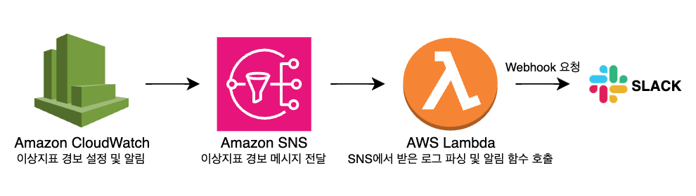
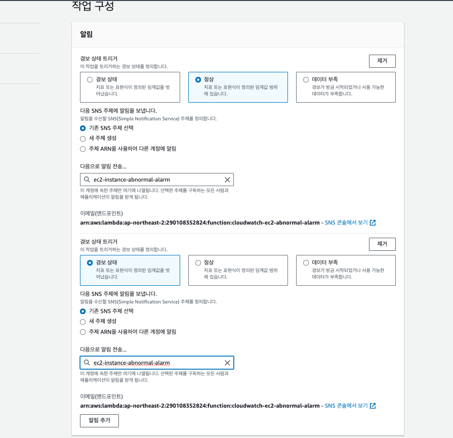

# [AWS] CloudWatch 이상 지표 모니터링 (feat. SNS)

> 📌 AWS 서비스를 이용하여 애플리케이션을 호스팅하거나 배포를 할 때 내 애플리케이션에 문제가 없는지 확인할 수 있는 다양한 방법이 있습니다. 바로 CloudWatch를 이용하여 이상 지표에 대해 알림을 받는 방법입니다. 설정부터 실제 알림을 받는 방법까지 다뤄보겠습니다.

아키텍쳐 개요는 다음과 같습니다:



<br>

# 📍 Amazon CloudWatch

_Amazon CloudWatch는 애플리케이션을 `모니터링`하고, 성능 변화에 대응하고, 리소스 사용을 최적화하며, 운영 상태에 대한 인사이트를 제공하는 서비스입니다. CloudWatch는 AWS 리소스 전반의 데이터를 수집하여 전체 시스템의 성능을 파악할 수 있도록 하고, **사용자가 경보를 설정**하고, 변화에 자동으로 대응하고, 운영 상태에 대한 통합된 뷰를 볼 수 있도록 합니다._

출처: [공식문서 - Amazon CloudWatch](https://aws.amazon.com/ko/cloudwatch/)

EC2 인스턴스나 Lambda 함수를 이용하여 애플리케이션을 배포할 때 대다수의 회사 혹은 프로젝트 개발자들은 CloudWatch 서비스를 이용하여 로그를 모니터링하고 축적할텐데요. 로그를 볼 수만 있는 상황에서 갑자기 서버가 다운되어 버리면 개발자의 연봉도 다운되겠죠… 이런 상황을 방지하기 위해 CloudWatch에서는 이상 지표에 대해 경보를 설정할 수 있습니다.

경보를 설정하기 전에 해당 경보를 전달하는 SNS 주제를 생성해보겠습니다.

<br>

# 📍 Amazon SNS

_Amazon Simple Notification Service(Amazon SNS, 이하 SNS)는 게시자에서 구독자(생산자 및 소비자라고도 함)로 `메시지를 전송`하는 관리형 서비스입니다._

[출처: [공식문서 - Amazon SNS](https://docs.aws.amazon.com/ko_kr/sns/latest/dg/welcome.html)]

SNS는 주로 알림 서비스에 많이 사용되며 다수의 애플리케이션 간의 대규모로 메시지를 배포할 수 있는데요. 주요 기능에 대해 간단하게 알아보겠습니다.

### ✔️ 주요 기능

1. **주제(Topic)**:
   - SNS에서 주제는 메시지를 수신할 수 있는 논리적 접근점이자 채널입니다. 발행자(publisher)는 메시지를 주제에 게시하고, 구독자(subscriber)는 해당 주제에 대한 알림을 수신합니다.
2. **구독(Subscription)**:
   - 주제에 대한 구독은 메시지 수신 방법을 정의합니다. SNS는 다양한 프로토콜을 통해 메시지를 전달할 수 있는데, 여기에는 HTTP/HTTPS, 이메일, SMS, 모바일 푸시, AWS Lambda 함수 등이 포함됩니다.
3. **발행/구독 모델**:
   - SNS는 발행-구독(pub/sub) 모델을 따릅니다. 발행자는 메시지를 주제에 게시하고, 각 구독자는 자신이 선택한 방식으로 메시지를 수신합니다. 이로 인해 발행자와 구독자 간의 느슨한 결합이 가능해지며, 시스템의 확장성 및 유연성을 높일 수 있습니다.
4. **알림 메시지**:
   - SNS를 통해 전송되는 메시지는 구조화된 데이터일 수도 있고 단순한 텍스트일 수도 있습니다. 메시지의 내용과 형식은 특정 애플리케이션의 요구사항에 따라 다양하게 설정할 수 있습니다.

### ✔️ 메시지

SNS에서 계속 언급되는 메시지는 일종의 데이터입니다. 즉 발행자에서 구독자에게 전달되는 데이터 단위입니다. 메시지의 구조는 서비스에 따라 다를 수 있지만, 일반적으로 다음과 같은 요소를 포함할 수 있습니다:

- **메시지 본문(Body)**:
  - 메시지의 주요 내용입니다. 텍스트, JSON, XML 등의 형식으로 표현될 수 있습니다.
- **메시지 속성(Properties)**:
  - 메시지 본문 외에 추가적인 메타데이터로, 메시지의 목적지, 유형, 우선순위 등의 정보를 포함할 수 있습니다.
- **메시지 ID**:
  - 메시지를 고유하게 식별하는 데 사용되는 ID입니다.

<br>

# 📍 AWS Lambda

_서버리스 컴퓨팅 서비스 중 하나로 서버 프로비저닝 또는 관리, 워크로드 인식 클러스터 확장 로직 생성, 이벤트 통합 유지 또는 런타임 관리 없이 코드를 실행할 수 있는 서비스입니다._

[출처: [AWS Lambda](https://aws.amazon.com/ko/pm/lambda/?gclid=Cj0KCQjwwae1BhC_ARIsAK4JfrwgyKOEIoEGtuuVJb6Iu_J6F32hOLQOVLbw1NOVtxR8-VbaBMenQ04aAvwvEALw_wcB&trk=b28d8305-f5fb-4858-9ae6-04a78cfcc154&sc_channel=ps&ef_id=Cj0KCQjwwae1BhC_ARIsAK4JfrwgyKOEIoEGtuuVJb6Iu_J6F32hOLQOVLbw1NOVtxR8-VbaBMenQ04aAvwvEALw_wcB:G:s&s_kwcid=AL!4422!3!651510601848!e!!g!!amazon%20lambda!19836398350!150095232634)]

서버리스 컴퓨팅이라는 것은 서버가 없다는 것을 가리킵니다. 서버가 없기 때문에 개발자는 코드 실행에만 집중할 수 있습니다. Lambda를 사용하면 서버를 프로비저닝하거나 관리할 필요 없이 코드를 실행할 수 있다는 장점이 있죠.

### ✔️ 주요 특징

주요 특징은 다음과 같습니다.

1. **서버리스 아키텍처**:
   - Lambda는 코드가 실행될 때만 컴퓨팅 자원을 할당하며, 실행이 끝나면 자원을 자동으로 회수합니다. 이는 개발자가 인프라 관리를 신경 쓰지 않고 애플리케이션의 비즈니스 로직에 집중할 수 있게 합니다.
2. **이벤트 기반**:
   - Lambda 함수는 다양한 AWS 서비스에서 발생하는 이벤트에 의해 트리거됩니다.
   - 이벤트 소스는 Lambda 함수를 호출하는 트리거 역할을 합니다. 이벤트 소스로는 S3, DynamoDB, Kinesis, SNS, CloudWatch, API Gateway 등이 있습니다.
   - 예를 들어, S3에 파일이 업로드되거나, DynamoDB 테이블에 항목이 추가되는 등의 이벤트가 있을 때 Lambda 함수가 실행될 수 있습니다.
3. **자동 확장성 (Auto Scalable)**:
   - 수요에 따라 자동으로 확장됩니다. 즉, 이벤트가 발생하면 Lambda가 자동으로 추가 인스턴스를 생성하여 동시에 여러 이벤트를 처리할 수 있습니다.
4. **Python, Java, Node.js, C#, Go, Ruby 등 다양한 프로그래밍 언어 지원**

<br>

---

이제 알람을 받기 전 개념은 어느정도 파악은 된 것 같으니 콘솔에서 실제 서비스를 다뤄보겠습니다.

---

<br>

# ⚙️ 1. Amazon SNS 주제 생성

### ✔️ 1-1) SNS 콘솔 이동

AWS 콘솔에 접속하여 검색창에 SNS를 입력합니다.

우측에 보이는 `다음 단계` 버튼을 클릭하여 SNS 주제 생성 페이지로 이동합니다.


### ✔️ 1-2) Amazon SNS 유형 및 이름 설정

유형은 표준으로 설정해주고 SNS 주제 이름을 정해줍니다.


<br>

# ⚙️ 2. Lambda 함수 생성

이제 SNS에서 메시지를 구독하는 Lambda 함수를 생성해보겠습니다.

### ✔️ 2-1) Lambda 기본 정보 세팅

다음과 같이 함수를 새로 작성해주고 이름을 작성해줍니다.

런타임에는 작성할 코드가 실행될 런타임을 선택해주면 됩니다.


Lambda 함수가 CloudWatch에 접근할 수 있는 액세스 권한이 있는 역할을 기존에 미리 만들어두어도 되고 새 역할을 생성해도 무방합니다.


### ✔️ 2-2) Lambda 함수 작성

새로운 Lambda를 생성하였다면 이제 코드를 직접 작성해줍니다. 코드 소스에서 코드를 직접 수정하고 `Deploy` 버튼을 눌러주면 됩니다.


예시 코드는 다음과 같습니다. 실제 프로젝트에 맞도록 변경하면 되겠습니다.

```jsx
const https = require("https");

export const handler = async (event) => {
  const snsMessage = event.Records[0].Sns.Message;
  const webhookUrl = process.env.webhook;
  const message = JSON.parse(snsMessage);

  return new Promise((resolve, reject) => {
    const req = https.request(options, (res) => {
      let responseBody = "";

      res.on("data", (chunk) => {
        responseBody += chunk;
      });

      res.on("end", () => {
        resolve(responseBody);
      });
    });

    req.on("error", (err) => {
      reject(err);
    });

    req.write(JSON.stringify(message));
    req.end();
  });
};
```

작성한 Lambda 함수를 테스트 해볼 수도 있습니다. 위 Lambda 함수에서는 SNS 메시지를 파싱하는 디테일한 코드가 없기 때문에 이벤트 JSON 테스트 양식만 확인하면 되겠습니다.

- 테스트 JSON
  ```jsx
  {
    "Records": [
      {
        "EventSource": "aws:sns",
        "EventVersion": "1.0",
        "EventSubscriptionArn": "arn:aws:sns:ap-northeast-2:981604548033:alarm-topic:test",
        "Sns": {
          "Type": "Notification",
          "MessageId": "test",
          "TopicArn": "arn:aws:sns:ap-northeast-2:123123:test-alarm-topic",
          "Subject": "ALARM: \"RDS-CPUUtilization-high\" in Asia Pacific (Seoul)",
          "Message": "{\"AlarmName\":\"Aurora PostgreSQL CPU 알람 (60%이상시)\",\"AlarmDescription\":\"Aurora PostgreSQL CPU 알람 (60%이상시)\",\"AWSAccountId\":\"981604548033\",\"NewStateValue\":\"ALARM\",\"NewStateReason\":\"Threshold Crossed: 3 out of the last 3 datapoints [8.891518474692088 (14/07/21 23:18:00), 9.72 (14/07/21 23:17:00), 9.18241509182415 (14/07/21 23:16:00)] were greater than or equal to the threshold (7.0) (minimum 3 datapoints for OK -> ALARM transition).\",\"StateChangeTime\":\"2021-07-14T23:20:50.708+0000\",\"Region\":\"Asia Pacific (Seoul)\",\"AlarmArn\":\"arn:aws:cloudwatch:ap-northeast-2:981604548033:alarm:Aurora PostgreSQL CPU 알람 (60%이상시)\",\"OldStateValue\":\"OK\",\"Trigger\":{\"MetricName\":\"CPUUtilization\",\"Namespace\":\"AWS/RDS\",\"StatisticType\":\"Statistic\",\"Statistic\":\"MAXIMUM\",\"Unit\":null,\"Dimensions\":[{\"value\":\"aurora-postgresql\",\"name\":\"EngineName\"}],\"Period\":60,\"EvaluationPeriods\":3,\"ComparisonOperator\":\"GreaterThanOrEqualToThreshold\",\"Threshold\":7,\"TreatMissingData\":\"- TreatMissingData:                    ignore\",\"EvaluateLowSampleCountPercentile\":\"\"}}",
          "Timestamp": "2021-06-07T11:31:17.380Z",
          "SignatureVersion": "1",
          "MessageAttributes": {}
        }
      }
    ]
  }
  ```

위 JSON 값을 저장해주고 테스트를 발송하면 Lambda 함수에 의해 슬랙이 발송됩니다.


실제로 받는 슬랙 메시지는 메시지 빌더를 이용하여 아래처럼 깔끔하게 보낼 수 있습니다.


환경변수를 등록하고 싶다면, `구성 -> 환경 변수` 에서 필요한 환경 변수의 key와 value를 등록해주면 됩니다. 여기서 조금 더 보안에 신경쓰고 싶으면 KMS (Amazon Key Management Service)를 이용하여 암호화를 하는 방법도 있겠습니다.


### ✔️ 2-3) SNS 구독하기

이제 Lambda 함수가 구독하는 SNS 트리거를 설정해주면 됩니다.


트리거 추가를 클릭하여 SNS와 구독할 SNS 주제를 추가해주면 끝입니다.


<br>

# ⚙️ 3. CloudWatch 경보를 SNS와 연동하기

이제 CloudWatch 콘솔로 이동해보겠습니다.

### ✔️ 3-1) CloudWatch 경보 생성

이미 생성된 많은 경보들을 확인할 수 있는데요. 경보를 생성하는 방법은 간단합니다. 우측 `경보 생성` 버튼을 클릭해주세요.


그럼 지표를 선택할 수 있는 화면으로 이동합니다. 여기서는 경보 설정에 필요한 지표들을 확인할 수 있습니다.


현재 애플리케이션을 EC2 인스턴스에 배포하는 것을 가정으로 하기 때문에 EC2 인스턴스에 관한 지표를 확인해보겠습니다. 선택할 수 있는 지표가 인스턴스 별로 존재하는데요. 여기서 CPU 사용량을 확인할 수 있는 CPUUtilization 지표를 선택합니다.


필요한 세부 지표를 잘 설정해주면 됩니다.


다음으로 경보 상태를 SNS 주제에 보낼 트리거와 알림을 설정합니다. 아까 생성한 SNS 주제를 선택하면 되는데요. 경보 상태는 인스턴스의 CPU 사용량이 70% 이상일 때 그리고 다시 정상으로 돌아왔을 때 각각 알림을 보내야 하기 때문에 알림을 2개를 생성해주면 됩니다.



SNS 알림을 보낼 때 필요한 경보 이름과 설명을 적절히 작성해주면 경보가 잘 생성되었습니다.


# ‼️ 실제 알림

아직 서비스를 운영하면서 CPU 사용량이 초과되는 적은 없었기에 실제 알림을 받은 적이 없습니다.

하지만 EC2 인스턴스에 의도적으로 부하를 주어 CPU 사용량을 높일 수 있는데요. 이는 다른 포스팅에서 소개하겠습니다.

첫 연동이 되면 데이터 부족 상태에서 정상으로 상태가 바뀌게 됩니다. 이 때 경보 상태 트리거 중 정상 상태일 때 알림이 트리거 되기 때문에 아래와 같은 슬랙 메시지를 받을 수 있습니다.


### 🙆 알고 가면 좋아요~

- SNS와 Lambda 함수는 계속 동일하게 사용해도 무방합니다. CloudWatch 경보만 설정해주면 돼요!
- CloudWatch 경보를 생성할 땐 기본적으로 이상 지표를 하나만 설정할 수 있습니다. 복합 경보가 필요한 경우 복합 경보 설정을 위한 세팅이나, 다중 소스 쿼리를 이용할 수 있습니다.

---

### 참고자료

- Chat GPT~
- AWS 공식문서
  - https://docs.aws.amazon.com/ko_kr/sns/latest/dg/welcome.html
  - [https://aws.amazon.com/ko/pm/lambda/?gclid=CjwKCAjw5Ky1BhAgEiwA5jGujrQCkbnMNftijnEoNxa8OeLT6PHndQeygkyqFaCANtF9aOI3xq-uQBoCNUAQAvD_BwE&trk=b28d8305-f5fb-4858-9ae6-04a78cfcc154&sc_channel=ps&ef_id=CjwKCAjw5Ky1BhAgEiwA5jGujrQCkbnMNftijnEoNxa8OeLT6PHndQeygkyqFaCANtF9aOI3xq-uQBoCNUAQAvD_BwE:G:s&s_kwcid=AL!4422!3!651510601848!e!!g!!amazon lambda!19836398350!150095232634](https://aws.amazon.com/ko/pm/lambda/?gclid=CjwKCAjw5Ky1BhAgEiwA5jGujrQCkbnMNftijnEoNxa8OeLT6PHndQeygkyqFaCANtF9aOI3xq-uQBoCNUAQAvD_BwE&trk=b28d8305-f5fb-4858-9ae6-04a78cfcc154&sc_channel=ps&ef_id=CjwKCAjw5Ky1BhAgEiwA5jGujrQCkbnMNftijnEoNxa8OeLT6PHndQeygkyqFaCANtF9aOI3xq-uQBoCNUAQAvD_BwE:G:s&s_kwcid=AL!4422!3!651510601848!e!!g!!amazon%20lambda!19836398350!150095232634)
  - https://aws.amazon.com/ko/cloudwatch/
